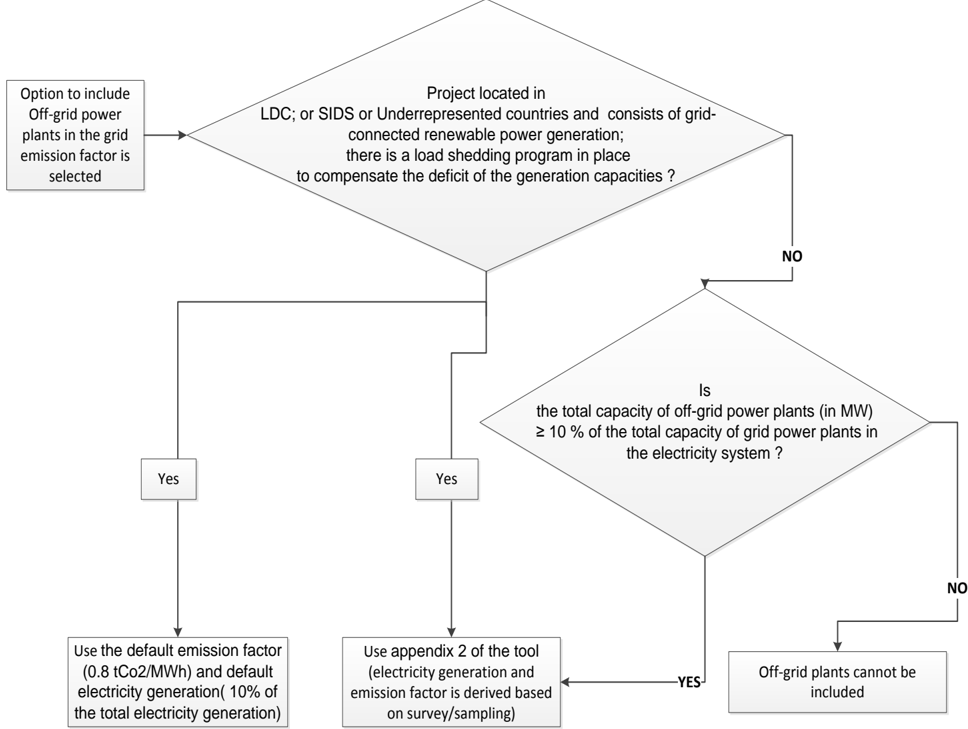
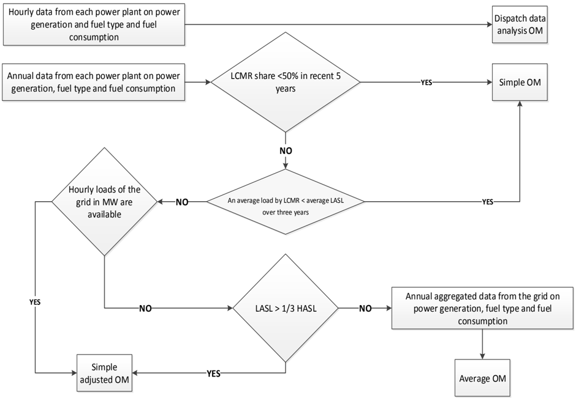
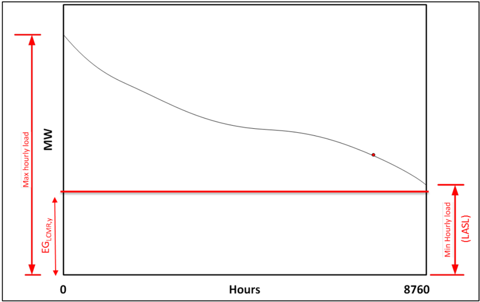
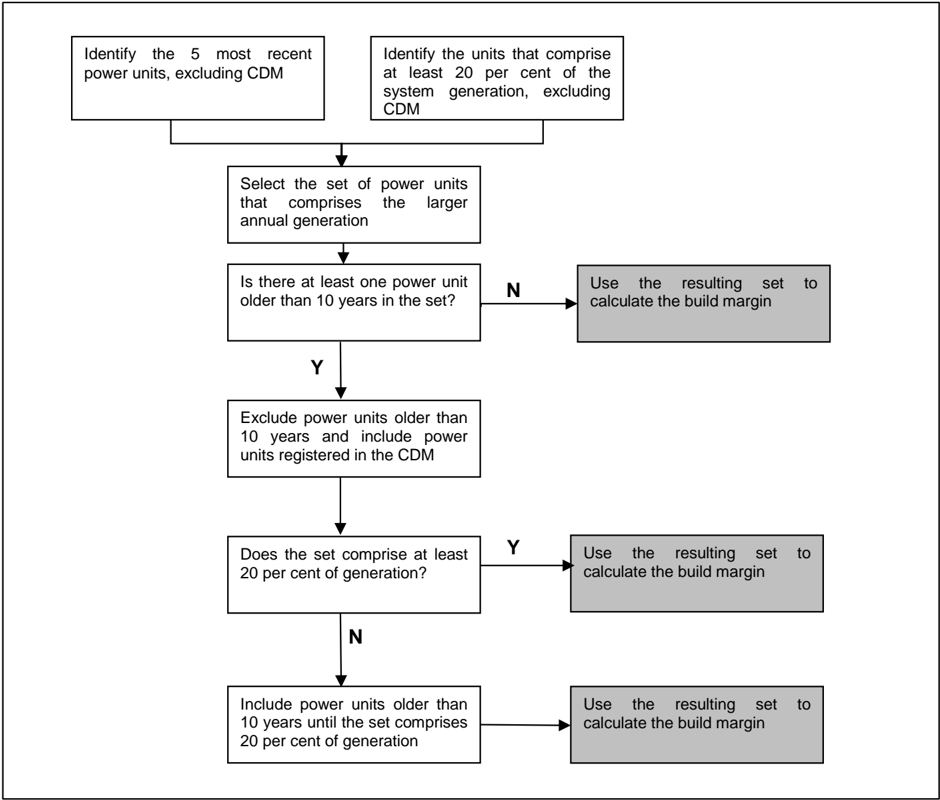
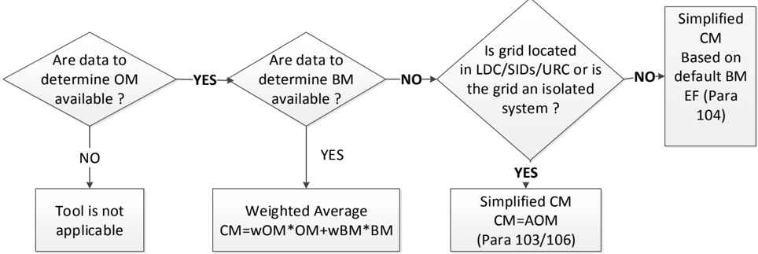
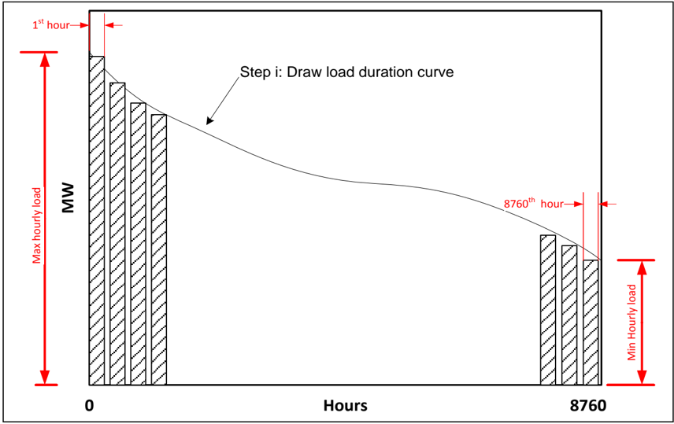
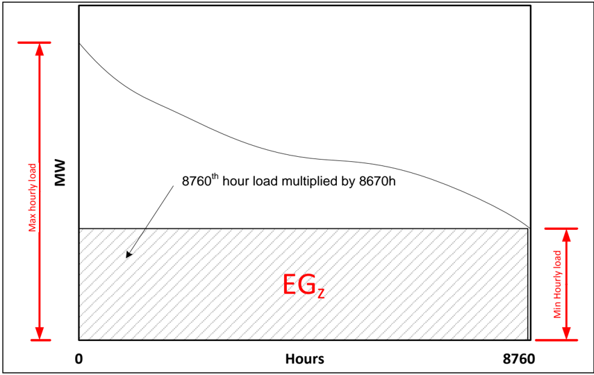
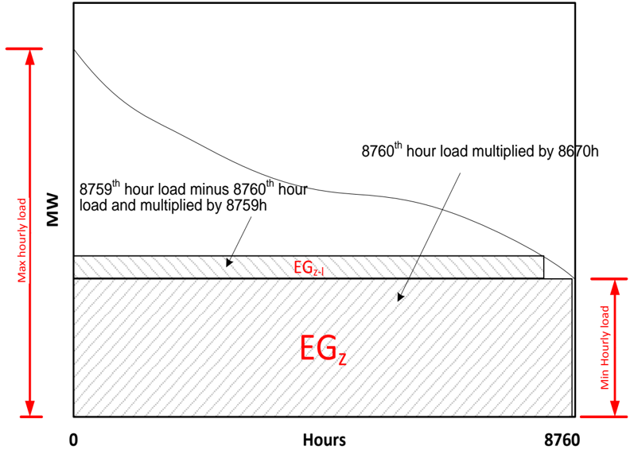
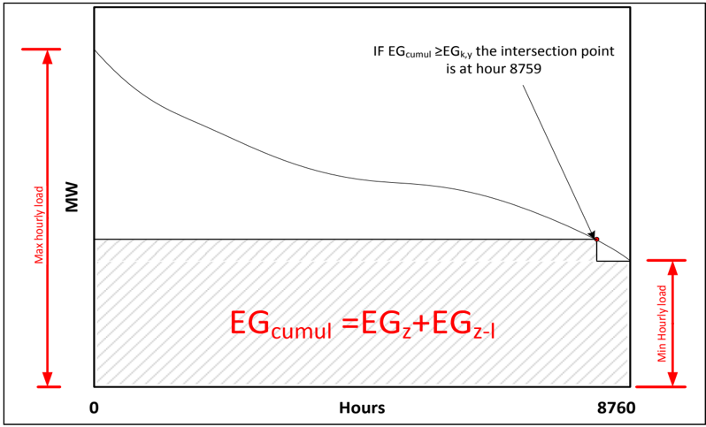
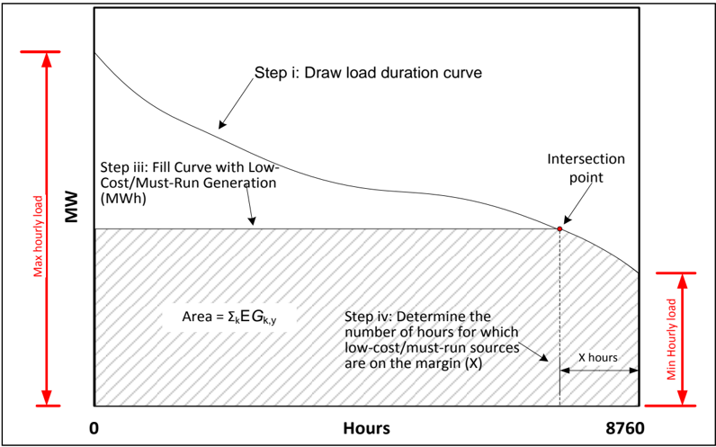

TOOL07

## Methodological tool

Tool to calculate the emission factor for an electricity system

Version 07.0

| TABLE OF CONTENTS                                                                                                           | TABLE OF CONTENTS                                                                                                                                                                    | TABLE OF CONTENTS                                                                                                                                                                    | TABLE OF CONTENTS                                                                                                                                                                    |   Page |
|-----------------------------------------------------------------------------------------------------------------------------|--------------------------------------------------------------------------------------------------------------------------------------------------------------------------------------|--------------------------------------------------------------------------------------------------------------------------------------------------------------------------------------|--------------------------------------------------------------------------------------------------------------------------------------------------------------------------------------|--------|
| 1. INTRODUCTION........................................................................................................     | 1. INTRODUCTION........................................................................................................                                                              | 1. INTRODUCTION........................................................................................................                                                              | 1. INTRODUCTION........................................................................................................                                                              |      4 |
| 2. SCOPE, APPLICABILITY, AND ENTRY INTO FORCE...........................................                                    | 2. SCOPE, APPLICABILITY, AND ENTRY INTO FORCE...........................................                                                                                             | 2. SCOPE, APPLICABILITY, AND ENTRY INTO FORCE...........................................                                                                                             | 2. SCOPE, APPLICABILITY, AND ENTRY INTO FORCE...........................................                                                                                             |      4 |
| 2.1.                                                                                                                        |                                                                                                                                                                                      | Scope .............................................................................................................                                                                  | Scope .............................................................................................................                                                                  |      4 |
|                                                                                                                             | 2.2.                                                                                                                                                                                 | Applicability ....................................................................................................                                                                   | Applicability ....................................................................................................                                                                   |      4 |
|                                                                                                                             | 2.3.                                                                                                                                                                                 | Entry into force ...............................................................................................                                                                     | Entry into force ...............................................................................................                                                                     |      4 |
| 3. NORMATIVE REFERENCES....................................................................................                 | 3. NORMATIVE REFERENCES....................................................................................                                                                          | 3. NORMATIVE REFERENCES....................................................................................                                                                          | 3. NORMATIVE REFERENCES....................................................................................                                                                          |      5 |
| 4. DEFINITIONS............................................................................................................. | 4. DEFINITIONS.............................................................................................................                                                          | 4. DEFINITIONS.............................................................................................................                                                          | 4. DEFINITIONS.............................................................................................................                                                          |      5 |
| 5. PARAMETERS...........................................................................................................    | 5. PARAMETERS...........................................................................................................                                                             | 5. PARAMETERS...........................................................................................................                                                             | 5. PARAMETERS...........................................................................................................                                                             |      7 |
| 6. BASELINE METHODOLOGY PROCEDURE...........................................................                                | 6. BASELINE METHODOLOGY PROCEDURE...........................................................                                                                                         | 6. BASELINE METHODOLOGY PROCEDURE...........................................................                                                                                         | 6. BASELINE METHODOLOGY PROCEDURE...........................................................                                                                                         |      8 |
| 6.1.                                                                                                                        | Step 1: Identify the relevant electricity systems.............................................                                                                                       | Step 1: Identify the relevant electricity systems.............................................                                                                                       | Step 1: Identify the relevant electricity systems.............................................                                                                                       |      8 |
| 6.2.                                                                                                                        | Step 2: Choose whether to include off-grid power plants in the project electricity system (optional)............................................................................     | Step 2: Choose whether to include off-grid power plants in the project electricity system (optional)............................................................................     | Step 2: Choose whether to include off-grid power plants in the project electricity system (optional)............................................................................     |     11 |
|                                                                                                                             | 6.2.1.                                                                                                                                                                               | Option I:.........................................................................................                                                                                   | Option I:.........................................................................................                                                                                   |     11 |
|                                                                                                                             | 6.2.2.                                                                                                                                                                               |                                                                                                                                                                                      | Option II:........................................................................................                                                                                   |     11 |
|                                                                                                                             |                                                                                                                                                                                      | 6.2.3.                                                                                                                                                                               | Option IIa:......................................................................................                                                                                    |     11 |
|                                                                                                                             |                                                                                                                                                                                      | 6.2.4.                                                                                                                                                                               | Option IIb:......................................................................................                                                                                    |     12 |
| 6.3.                                                                                                                        | Step 3: Select a method to determine the operating margin (OM)................                                                                                                       | Step 3: Select a method to determine the operating margin (OM)................                                                                                                       | Step 3: Select a method to determine the operating margin (OM)................                                                                                                       |     13 |
| 6.4.                                                                                                                        | Step 4: Calculate the operating margin emission factor according to the selected method............................................................................................. | Step 4: Calculate the operating margin emission factor according to the selected method............................................................................................. | Step 4: Calculate the operating margin emission factor according to the selected method............................................................................................. |     16 |
|                                                                                                                             |                                                                                                                                                                                      | 6.4.1.                                                                                                                                                                               | Simple OM....................................................................................                                                                                        |     16 |
|                                                                                                                             | 6.4.2.                                                                                                                                                                               |                                                                                                                                                                                      | Simple adjusted OM......................................................................                                                                                             |     20 |
|                                                                                                                             | 6.4.3.                                                                                                                                                                               |                                                                                                                                                                                      | Dispatch data analysis OM...........................................................                                                                                                 |     21 |
|                                                                                                                             | 6.4.4.                                                                                                                                                                               |                                                                                                                                                                                      | Average OM..................................................................................                                                                                         |     23 |
| 6.5.                                                                                                                        | Step 5: Calculate the build margin (BM) emission factor...............................                                                                                               | Step 5: Calculate the build margin (BM) emission factor...............................                                                                                               | Step 5: Calculate the build margin (BM) emission factor...............................                                                                                               |     24 |
| 6.6.                                                                                                                        | Step 6: Calculate the combined margin emissions factor..............................                                                                                                 | Step 6: Calculate the combined margin emissions factor..............................                                                                                                 | Step 6: Calculate the combined margin emissions factor..............................                                                                                                 |     27 |
|                                                                                                                             |                                                                                                                                                                                      | 6.6.1.                                                                                                                                                                               | Weighted average CM..................................................................                                                                                                |     28 |
|                                                                                                                             |                                                                                                                                                                                      | 6.6.2.                                                                                                                                                                               | Simplified CM................................................................................                                                                                        |     29 |
|                                                                                                                             | 6.6.3.                                                                                                                                                                               | Simplified combined margin emission factor                                                                                                                                           | approach for isolated grid system ......................................................................                                                                             |     30 |

|                                                                                                                                                                             | 6.7.                                                                                                                                                                        | Data and parameters not monitored ..............................................................                                                                            |   31 |
|-----------------------------------------------------------------------------------------------------------------------------------------------------------------------------|-----------------------------------------------------------------------------------------------------------------------------------------------------------------------------|-----------------------------------------------------------------------------------------------------------------------------------------------------------------------------|------|
|                                                                                                                                                                             | 6.8.                                                                                                                                                                        | Project activity under a programme of activities ............................................                                                                               |   31 |
| 7.                                                                                                                                                                          | MONITORING METHODOLOGY..............................................................................                                                                        | MONITORING METHODOLOGY..............................................................................                                                                        |   32 |
|                                                                                                                                                                             | 7.1. Monitoring parameters for isolated grid system.............................................                                                                            | 7.1. Monitoring parameters for isolated grid system.............................................                                                                            |   38 |
| APPENDIX 1. PROCEDURES RELATED TO OFF-GRID POWER GENERATION......                                                                                                           | APPENDIX 1. PROCEDURES RELATED TO OFF-GRID POWER GENERATION......                                                                                                           | APPENDIX 1. PROCEDURES RELATED TO OFF-GRID POWER GENERATION......                                                                                                           |   45 |
| APPENDIX 2. DEFAULT LAMBDA VALUES.................................................................                                                                          | APPENDIX 2. DEFAULT LAMBDA VALUES.................................................................                                                                          | APPENDIX 2. DEFAULT LAMBDA VALUES.................................................................                                                                          |   51 |
| APPENDIX 3. STEP WISE PROCEDURE TO DETERMINE THE LAMBDA OF A YEAR (  Y ) ................................................................................................. | APPENDIX 3. STEP WISE PROCEDURE TO DETERMINE THE LAMBDA OF A YEAR (  Y ) ................................................................................................. | APPENDIX 3. STEP WISE PROCEDURE TO DETERMINE THE LAMBDA OF A YEAR (  Y ) ................................................................................................. |   52 |
| APPENDIX 4. EQUATION FOR CALCULATING WEIGHTED AVERAGE EMISSION FACTOR FOR AN ISOLATED GRID....................................                                              | APPENDIX 4. EQUATION FOR CALCULATING WEIGHTED AVERAGE EMISSION FACTOR FOR AN ISOLATED GRID....................................                                              | APPENDIX 4. EQUATION FOR CALCULATING WEIGHTED AVERAGE EMISSION FACTOR FOR AN ISOLATED GRID....................................                                              |   56 |

## 1. Introduction

1. This  methodological  tool  determines  the  CO2  emission  factor  for  the  displacement  of electricity  generated  by  power  plants  in  an  electricity  system,  by  calculating  the 'combined margin' emission factor (CM) of the electricity system.

## 2. Scope, applicability, and entry into force

## 2.1. Scope

2. The CM is the result  of  a  weighted  average  of  two  emission  factors  pertaining  to  the electricity  system:  the  'operating  margin'  (OM)  and  the  'build  margin'  (BM).  The operating margin is the emission factor that refers to the group of existing power plants whose  current  electricity  generation  would  be  affected  by  the  proposed  CDM  project activity.  The build margin is the emission factor that refers to the group of prospective power  plants  whose  construction  and  future  operation  would  be  affected  by  the proposed CDM project activity.

## 2.2. Applicability

3. This tool may be applied to estimate the OM, BM and/or CM when calculating baseline emissions  for  a  project  activity  that  substitutes  grid  electricity  that  is  where  a  project activity  supplies  electricity  to  a  grid  or  a  project  activity  that  results  in  savings  of electricity that would have been provided by the grid (e.g. demand-side energy efficiency projects).
4. Under this tool, the emission factor for the project electricity system can be calculated either for grid power plants only or, as an option, can include off-grid power plants. In the latter  case,  two  sub-options  under  the  step  2  of  the  tool  are  available  to  the  project participants, i.e. option IIa and option IIb. If option IIa is chosen, the conditions specified in 'Appendix 1: Procedures related to off-grid power generation' should be met. Namely, the total capacity of off-grid power plants (in MW) should be at least 10 per cent of the total  capacity  of  grid  power  plants  in  the  electricity  system;  or  the  total  electricity generation by off-grid power plants (in MWh) should be at least 10 per cent of the total electricity generation by grid power plants in the electricity system; and that factors which negatively affect the reliability and stability of the grid are primarily due to constraints in generation and not to other aspects such as transmission capacity.
5. In  case  of  CDM  projects  the  tool  is  not  applicable  if  the  project  electricity  system  is located partially or totally in an Annex I country.
6. Under this tool, the value applied to the CO2 emission factor of biofuels is zero.

## 2.3. Entry into force

7. The date of entry into force is the date of the publication of the EB 100 meeting report on 31 August 2018.

## 3. Normative references

8. This tool refers to the latest approved versions of the TOOL09: Determining the baseline efficiency of thermal or electric energy generation systems'. This tool is also referred to in the TOOL05 "Baseline, project and/or leakage emissions from electricity consumption and monitoring of electricity generation' for the purpose of calculating baseline, project and leakage emissions in case where a project activity consumes electricity from the grid or  results  in  increase  of  consumption  of  electricity  from  the  grid  outside  the  project boundary.

## 4. Definitions

9. The definitions contained in the Glossary of CDM terms shall apply.
10. For the purpose of this tool, the following definitions apply:
3. (a) Power plant/unit -  a  power plant/unit is a facility that generates electric power. Several power units at one site comprise one power plant, whereas a power unit is  characterized by the fact that it can operate independently from other power units  at  the  same  site.  Where  several  identical  power  units  (i.e.  with  the  same capacity, age and efficiency) are installed at one site, they may be considered as one single power unit;
4. (b) Grid  power  plant/unit -  a  power  plant/unit  that  supplies  electricity  to  an electricity  grid  and,  if  applicable,  to  specific  consumers. This means that power plants  supplying  electricity  to  the  grid  and  specific  captive  consumers  at  the project are considered as a grid power plant/unit, while power plants that serve only  captive  consumers  and  do  not  supply  electricity  to  the  grid  are  not considered as a grid power plant/unit;
5. (c) Off-grid power plant/unit - a power plant/unit that supplies electricity to specific consumers  through  a  dedicated  distribution  network  which  is  not  used  by  any other power plants. For a power plant to be categorized as off-grid, the following conditions need be fulfilled:
6. (i) A contract specifying the service between the power plant and the isolated user (indicating time of service and conditions of supply);
7. (ii) A grid (or grids) capable of supplying power to the specific consumer(s) to which the off-grid facility is connected, must exist;
8. (iii) The off-grid facility is not connected to the grid(s) and cannot supply power to the grid(s), but only to the consumer(s) to which it is connected;
9. (iv) Under  normal conditions, the consumer(s) are supplied their  power requirements  from  the  grid  only,  that  is  the  off-grid  plant(s)  which  is connected to the consumer(s) is a standby on-site facility(ies) that is only used when power supply from the grid fails (or in many cases, when the quality of power supply to the end-user is below acceptable quality);
10. (v) To  ensure  a  proper  shift  from  the  grid  supply  to  the  off-grid  supply,  the consumer  has  in  place  a  change-over-switch  system  (which  may  be manual or automatic);

- (d) Net electricity generation - refers to the difference between the total quantity of electricity generated by the power plant/unit and the auxiliary electricity consumption  (also  known  as  parasitic  load)  of  the  power  plant/unit  (e.g.  for pumps, fans, controlling etc.);
- (e) Project electricity system - is defined by the spatial extent of the power plants that  are  physically  connected through transmission  and  distribution  lines  to the project activity (e.g. the renewable power plant location or the consumers where electricity  is  being  saved)  and  that  are  covered  by  either  single  or  layered dispatch area;
- (f) Isolated grid system - is an electricity system supplying electricity to household users, and if applicable, industries and commercial areas that is not connected to any  other  electrical  network  (e.g.  national/regional  or  interconnected  power system) and meet one of the following conditions:
- (i) Any  grid  located  in  a  Least  Developed  Country  (LDC)  or  small  island development State (SIDS) where at least 65 per cent of the power installed capacity is based on fossil fuel sources - solid, liquid or gaseous;
- (ii) Any  grid  where  65  per  cent  of  the  power  installed  capacity  is  based  on liquid fossil fuel sources;
- (iii) Any grid with a maximum power installed capacity of 1000 MW and at least 80 per cent of the power installed capacity is based on fossil fuel sources solid, liquid or gaseous;
- (g) Connected  electricity  system -  is  an  electricity  system  that  is  connected  by transmission lines to the project electricity system;
- (h) Dispatch  centre -  is  an  entity  responsible  for  keeping  the  electricity  system synchronized within its dispatch area. The dispatch centre responsibilities include scheduling generation and dispatching electricity from power plants to customers and, where applicable, to the connected electricity system(s);
- (i) Dispatch  area -  is  an  electricity  system  or  a  part  of  the  electricity  system controlled by a dispatch centre. A national electricity system could be controlled by  more  than  one  dispatch  centre,  that  are  either  organized  into  a  layered dispatch  area  or  into  independent  dispatch  areas.  An  example  of  a  layered dispatch  area  is  where  regional  dispatch  centres  are  required  to  comply  with orders of the national dispatch centre;
- (j) Low-cost/must-run (LCMR) resources -  are  defined  as  power plants with low marginal generation costs or dispatched independently of the daily or seasonal load of the grid. They include hydro, geothermal, wind, low-cost biomass, nuclear and solar generation. If a fossil fuel plant is dispatched independently of the daily or seasonal load of the grid and if this can be demonstrated based on the publicly available data, it should be considered as a low-cost/must-run. Electricity imports shall be treated as one LCMR power plant;
- (k) Load  shedding  program -  is  a  planned  action  that  consist  in  the  deliberate switching off of electrical supply to parts of the electricity system. Switching off is

required when there is an imbalance between electricity demand and electricity supply;

- (l) Lowest annual system load (LASL) - is the minimum recorded value of hourly load in MW in a grid over a calendar year;
- (m) Highest annual system load (HASL) - is the maximum recorded value of hourly load in MW in a grid over a calendar year.

## 5. Parameters

11. This tool provides procedures to determine the following parameters:
12. This tool provides different methods to determine OM and BM. The key data requirement for applying the methods are summarized in the table below.

Table 1. Parameters

| Parameter    | SI Unit     | Description                                                                        |
|--------------|-------------|------------------------------------------------------------------------------------|
| EF grid,CM,y | t CO 2 /MWh | Combined margin CO 2 emission factor for the project electricity system in year y  |
| EF grid,BM,y | t CO 2 /MWh | Build margin CO 2 emission factor for the project electricity system in year y     |
| EF grid,OM,y | t CO 2 /MWh | Operating margin CO 2 emission factor for the project electricity system in year y |

Table 2. Data requirements to determine OM and BM

|                                                                     | Dispatch data OM                           | Simple adjusted OM                         | Simple OM                                  | Average OM                                 | Build margin                               |
|---------------------------------------------------------------------|--------------------------------------------|--------------------------------------------|--------------------------------------------|--------------------------------------------|--------------------------------------------|
| Data requirements under respective options                          | Data requirements under respective options | Data requirements under respective options | Data requirements under respective options | Data requirements under respective options | Data requirements under respective options |
| Power generation per plant Option A1 prescribed under the Simple OM |                                            | ✓                                          | ✓                                          |                                            | ✓                                          |
| Power generation aggregated Option B prescribed under               |                                            |                                            |                                            |                                            |                                            |
|                                                                     |                                            |                                            | ✓                                          | ✓                                          |                                            |
| the Simple OM                                                       |                                            |                                            |                                            |                                            |                                            |
| Fuel consumption per plant                                          |                                            | ✓                                          | ✓                                          |                                            | ✓                                          |
| Option A1 prescribed under the Simple OM                            |                                            |                                            |                                            |                                            |                                            |
| Fuel type and technology                                            |                                            | ✓                                          | ✓                                          |                                            | ✓                                          |
| Option A2 prescribed under the Simple OM                            |                                            |                                            |                                            |                                            |                                            |

|                                                        | Dispatch data OM   | Simple adjusted OM   | Simple OM   | Average OM   | Build margin   |
|--------------------------------------------------------|--------------------|----------------------|-------------|--------------|----------------|
| Fuel consumption aggregated                            |                    |                      | ✓           | ✓            |                |
| Hourly power generation and fuel consumption per plant | ✓                  |                      |             |              |                |
| Hourly load of the grid                                |                    | ✓                    |             |              |                |
| Date of commissioning of power plants/units            |                    |                      |             |              | ✓              |

13. No methodology-specific parameters are required.

## 6. Baseline methodology procedure

14. Project participants shall apply the following six steps:
2. (a) Step 1: Identify the relevant electricity systems;
3. (b) Step 2: Choose  whether  to  include  off-grid  power  plants  in  the  project electricity system (optional);
4. (c) Step 3: Select a method to determine the operating margin (OM);
5. (d) Step 4: Calculate  the  operating  margin  emission  factor  according  to  the selected method;
6. (e) Step 5: Calculate the build margin (BM) emission factor;
7. (f) Step 6: Calculate the combined margin (CM) emission factor.

## 6.1. Step 1: Identify the relevant electricity systems

15. For determining the electricity emission factors, the project participants shall identify the relevant project electricity system .
16. Similarly, the project participants shall identify any connected electricity systems . If a connected electricity system is located partially or totally in Annex I countries, then the emission factor of that connected electricity system should be considered zero.
17. Project  participants  may  delineate  the  project  electricity  system  using  any  of  the following options:
4. (a) Option 1 . A delineation of the project electricity system and connected electricity systems published by the DNA or the group of the DNAs of the host country(ies), In  case  a  delineation  is  provided  by  a  group  of  DNAs,  the  same  delineation should be used by all the project participants applying the tool in these countries;
5. (b) Option 2 .  A delineation of the project electricity system defined by the dispatch area of the dispatch centre responsible for scheduling and dispatching electricity

generated by the project activity. Where the dispatch area is controlled by more than one dispatch centre, i.e. layered dispatch area, the higher level area shall be used  as  a  delineation  of  the  project  electricity  system  (e.g.  where  regional dispatch  centres  are  required  to  comply  with  dispatch  orders  of  the  national dispatch  centre  then  area  controlled  by  the  national  dispatch  centre  shall  be used);

- (c) Option 3 . A delineation of the project electricity system defined by more than one independent dispatch areas, e.g. multi-national power pools.
18. In case of option 3, transmission lines between dispatch areas included in the proposed delineation shall be  checked  for  the existence or non-existence  of  transmission constraints 1  following the paragraph 19 below.
19. There are no transmission constraints if any one of the following criteria is met: 2
- (a) In case  of electricity systems  with  spot  markets  for  electricity: there are differences  in  electricity  prices  (without  transmission  and  distribution  costs)  of less than five per cent between the two electricity systems at least during 90 per cent of  the  hours  of  the  most  recent  year  for  which  information  is  available  (at least one year data is required); or
- (b) The transmission line(s) is operated at 75 3  per cent or less of its rated capacity during  90  per  cent  or  more  of  the  hours  of  the  most  recent  year  for  which information  is  available  (at  least  one  year  data  is  required)  using  the  algorithm below:
- (i) For every hour of the year check whether the transmission line is operated at 75 per cent or less of its rated capacity;
- (ii) Each hour of the year when the transmission line was operated at 75 per cent or less of its rated capacity should be counted as zero;
- (iii) Each hour of the year when the transmission line was operated at 75 per cent or more of its rated capacity should be counted as one;

1 If  it  is  demonstrated  that  there  are  no  significant  transmission  constraints  between  the  'project electricity  system'and  'connected  electricity  system',  then  both  the  electricity  systems  together represent  a  single  project  electricity  system  and  a  common  grid  emission  factor  can  be  developed. When transmission constraints exist, no common grid emission actor can be developed and according to  paragraph  23  'electricity  transfers  from  a  connected  electricity  systems  to  the  project  electricity system are defined as electricity imports while electricity transfers from the project electricity system to connected electricity systems are defined as electricity exports .'

2 As an example, if one of the criteria is met, then a project participant intending to use a multi-country project electricity system would be able to justify that choice instead of using the national electricity grid as  the  project  electricity  system.  Note  that  project  participants  may  propose  other  criteria  or  submit proposals for revision of these criteria for consideration by the Board.

3 In case where the transmission line is operated at more than 75 cent but below 90 per cent of its rated capacity at least during 90 per cent or less of the hours and the project proponent wishes to consider there exists no transmission constraint (e.g. due to other operation conditions), proper justification shall be provided and documented transparently in the PDD.

- (iv) There is no transmission constraint if the total sum is less than ten per cent of the hours of the year (e.g. 876 for even year and 878 for leap year);
- (v) The algorithm can be illustrated by the following equation:

 $$\sum [ Hourly power transmission (MWℎ) [Maximum line ′ s load capacity (MW)] &gt; 75per cent ] &lt; 876 8760 1$$

- (vi) The maximum line's load capacity should be based on official information (e.g. from the operator of the system);
- (c) The transmission capacity of the transmission line(s) that is connecting electricity systems is more than 10 per cent of the installed capacity either of the project electricity system or of the connected electricity system, whichever is smaller.
20. In  addition,  in  cases  involving  international  interconnection  (i.e.  transmission  line  is between  different  countries  and  the  project  electricity  system  covers  national  grids  of interconnected countries) it should be further verified that there are no legal restrictions 4 for international electricity exchange.
21. If the information required to demonstrate transmission constraints (or not) is not publicly available  or  where  the  application  of  these  criteria  does  not  result  in  a  clear  grid boundary, project participants shall use a regional (i.e. sub-national) grid definition in the case of large countries with layered dispatch areas (e.g. provincial/regional/national).
22. A  provincial  grid  definition  may  indeed  in  many  cases  be  too  narrow  given  significant electricity trade among provinces that might be affected, directly or indirectly, by a CDM project activity. In other countries, the national (or other larger) grid definition should be used by default. The project participant shall document the geographical extent of the project electricity system transparently and identify all grid power plants/units connected to the system.
23. For the purpose of this tool, the reference system is the project electricity system. Hence electricity transfers from a connected electricity systems to the project electricity system are defined as electricity imports while electricity transfers from the project electricity system to connected electricity systems are defined as electricity exports .
24. For  the  purpose  of  determining  the  build  margin  emission  factor,  the  spatial  extent  is limited to the project electricity system, except where recent or likely future additions to the  transmission  capacity  enable  significant  increases  in  imported  electricity.  In  such cases, the transmission capacity may be considered a build margin source.
25. For  the  purpose  of  determining  the  operating  margin  emission  factor,  use  one  of  the following options to determine the CO2 emission factor(s) for net electricity imports from a connected electricity system:
- (a) 0 t CO2/MWh; or

4 For example, a legal agreement between the country that transmits electricity and the recipient country to  reduce  electricity  transmission  over  time,  while  transmission  capacity  of  the  transmission  line(s) remains the same should be considered as the significant transmission constraint.

- (b) The simple operating margin emission rate of the exporting grid, determined as described in Step 4 section 6.4.1, if the conditions for this method, as described in Step 3 below, apply to the exporting grid; or
- (c) The  simple  adjusted  operating  margin  emission  rate  of  the  exporting  grid, determined as described in Step 4 section 6.4.2 below; or
- (d) The weighted average operating margin (OM) emission rate of the exporting grid, determined as described in Step 4 section 6.4.4 below.
26. For  imports  from  connected  electricity  systems  located  in  Annex  I  country(ies),  the emission factor is 0 tons CO2 per MWh.
27. Electricity  exports  should  not  be  subtracted  from  electricity  generation  data  used  for calculating and monitoring the electricity emission factors.

## 6.2. Step  2:  Choose  whether  to  include  off-grid  power  plants  in  the  project electricity system (optional)

28. Project  participants  may  choose  between  the  following  two  options  to  calculate  the operating margin and build margin emission factor:

## 6.2.1. Option I:

29. Only grid power plants are included in the calculation.

## 6.2.2. Option II:

30. Both grid power plants and off-grid power plants are included in the calculation.
31. Option  II  provides  the  option  to  include  off-grid  power  generation  in  the  grid  emission factor.  Option  II  aims  to  reflect  that  in  some  countries  off-grid  power  generation  is significant  and  can  partially  be  displaced  by  CDM  project  activities  that  are  if  off-grid power plants are operated due to an unreliable and unstable electricity grid. Option II may  be  selected  only  for  determining  the  operating  margin  emission  factor  or  for determining both the build margin and the operating margin emission factor, but not for determining  the  build  margin  emission  factor  only.  Two  alternative  approaches  are provided  to  determine  the  electricity  generation  by  the  off-grid  power  plants  and  CO2 emission factor.

## 6.2.3. Option IIa:

32. Option IIa requires collecting data on off-grid power generation as per appendix 1 and can only be used if the conditions outlined therein are met.
33. If Option IIa is selected, off-grid power plants should be classified as per the guidance in appendix 1, that is in different off-grid power plants classes. Each off-grid power plant class should be considered as one power plant j , k , m or n .

## 6.2.4. Option IIb:

34. As an alternative approach, the default CO2 emission factor and the default value of the electricity  generated  by  the  off-grid  power  plants  can  be  applied  for  the  first  crediting period. The following conditions apply to this option:
2. (a) The project activity  is  located  in  (i)  a  Least  Developed  Country  (LDC);  or  (ii)  a Small  Island  Developing  States  (SIDS)  or  in  (iii)  a  country  with  less  than  10 registered CDM projects at the starting date of validation; and
3. (b) The project activities consist of grid-connected renewable power generation; and
4. (c) It  can  be  demonstrated  that  there  is  a  load  shedding  program  in  place  to compensate the deficit of the generation capacities.
35. For the off-grid power plants that choose Option IIb the default value of 0.8 tCO2/MWh can be used for the CO2 emission factor.
36. The following default values can be used to determine EGm,y for the off-grid plants:
7. (a) The value of 10 per cent of the total electricity generation by grid power plants in the electricity system for the purpose of the operating margin determination;
8. (b) The  value  of  10  per  cent  of  the  electricity  generation  by  grid  power  plants included in the sample group as per Step 5 for the purpose of the build margin determination.
37. The  following  flow  chart  provides  an  overview  on  the  requirement  to  include  off-grid power plants in the project electricity system described under Step 2, Option II.

Figure 1. Flow chart: Inclusion of off-grid power plants in the project electricity system

## 6.3. Step 3: Select a method to determine the operating margin (OM)

38. The calculation of the operating margin emission factor  ( EFgrid,OM,y )  is  based on one of the following methods, which are described under Step 4:
2. (a) Simple OM; or
3. (b) Simple adjusted OM; or
4. (c) Dispatch data analysis OM; or
5. (d) Average OM.
39. The  following flow chart provides an overview of OM  methods,  including data requirement  for  each  method  and  important  conditions  that  should  be  met  to  apply  a specific OM method.

Figure 2. Flow chart: Overview of the application of OM methods

40. The simple OM method (Option a in paragraph 38) can only be used if any one of the following requirements is satisfied:
2. (a) Low-cost/must-run  resources  constitute  less  than  50  per  cent  of  total  grid generation  (excluding  electricity  generated  by  off-grid power  plants)  in: 1) average of the five most recent years, and the average of the five most recent years shall be determined by using one of the approaches described below; or 2) based on long-term averages for hydroelectricity production (minimum time frame of 15 years):
3. (i) Approach 1

$$\text {Share} _ { L C M R } = \text {average} \left [ \frac { E G _ { L C M R _ { y - 4 } } } { \ t o t a l _ { y - 4 } } , \dots , \frac { E G _ { L C M R _ { y } } } { \ t o t a l _ { y } } \right ]$$

- (ii) Approach 2

$$\text {Share} _ { L C M R } = \frac { \ a v e r a g e \left ( E G _ { L C M R _ { y - 4 } } , \dots , E G _ { L C M R _ { y } } \right ) } { \ a v e r a g e \left ( t o t a l _ { y - 4 } , \dots , t o t a l _ { y } \right ) }$$

| Where:    |    |                                                                                                                      |
|-----------|----|----------------------------------------------------------------------------------------------------------------------|
| $EG LCMR y$ | =  | Electricity generation supplied to the project electricity system by the low cost/must run resources in year y (MWh) |
| $total y$   | =  | Total electricity generation supplied to the project electricity system in year y (MWh)                              |
| Y         | =  | The most recent year for which data is available                                                                     |

- (b) The average amount of load (MW) supplied by low-cost/must-run resources in a grid in the most recent three year ( i. e, average of EGLCMRy 8760 , EGLCMRy-1 8760 , EGLCMRy-2 8760 ) 5 is less than the average of the lowest annual system loads (LASL) in the grid of the  same  three  years  (i.e.  average  of  LASLy,  LASLy-1,  LASLy-2).  Please  see illustrative figure below.
41. The  dispatch  data  analysis  (Option  c)  cannot  be  used  if  off-grid  power  plants  are included in the project electricity system as per Step 2 above.
42. For the simple OM, the simple adjusted OM and the average OM, the emissions factor can be calculated using either of the two following data vintages:
- (a) Ex ante option: if the ex ante option is chosen, the emission factor is determined once  at  the  validation  stage,  thus  no  monitoring  and  recalculation  of  the emissions  factor  during  the  crediting  period  is  required.  For  grid  power  plants,

Figure 3. Load supplied by LCMR resources in a grid is less than a LASL

5 EGLCMR,y, EGLCMR,y-1, EGLCMR,y-2 is the total energy generation (MWh) by all LCMR sources in year y , y-1 and y-2 respectively.

use  a  3-year  generation-weighted  average,  based  on  the  most  recent  data available at the time of submission of the CDM-PDD to the DOE for validation. For off-grid power plants, use a single calendar year within the five most recent calendar years prior to the time of submission of the CDM-PDD for validation;

- (b) Ex post option: if the ex post option is chosen, the emission factor is determined for  the  year  in  which  the  project  activity  displaces  grid  electricity,  requiring  the emissions factor to be updated annually during monitoring. If the data required to calculate  the  emission  factor  for  year y is  usually  only  available  later  than  six months after the end of year y ,  alternatively  the emission factor of the previous year y-1 may be used. If the data is usually only available 18 months after the end of year y ,  the  emission factor of the year proceeding the previous  year y-2 may be used. The same data vintage ( y, y-1 or y-2 ) should be used throughout all crediting periods.
43. For the dispatch data analysis OM, use the year in which the project activity displaces grid electricity and update the emission factor annually during monitoring.
44. The data vintage chosen should be documented in the CDM-PDD and should not be changed during the crediting period.
45. Power  plants  registered  as  CDM  project  activities  should  be  included  in  the  sample group that is used to calculate the operating margin if the criteria for including the power source in the sample group apply.

## 6.4. Step  4:  Calculate  the  operating  margin  emission  factor  according  to  the selected method

## 6.4.1.  Simple OM

46. The simple OM emission factor is calculated as the generation-weighted average CO2 emissions per unit net electricity generation (t CO2/MWh) of all generating power plants serving the system, not including low-cost/must-run power plants/units.
47. The simple OM may be calculated by one of the following two options:
3. (a) Option A : Based on the net electricity generation and a CO2 emission factor of each power unit; 6 or
4. (b) Option B : Based  on  the  total  net  electricity  generation  of  all  power  plants serving the system and the fuel types and total fuel consumption of the project electricity system. Option B can only be used if:
5. (i) The necessary data for Option A is not available; and
6. (ii) Only  nuclear  and  renewable  power  generation  are  considered  as  lowcost/must-run power sources and the quantity of electricity supplied to the grid by these sources is known; and

6 Power units should be considered if some of the power units at the site of the power plant are  lowcost/must-run units and some are not. Power plants can be considered if all power units at the site of the power plant belong to the group of low-cost/must-run units or if all power units at the site of the power plant do not belong to the group of low-cost/must-run units.

- (iii) Off-grid power plants are not included in the calculation (i.e. if Option I has been chosen in Step 2).

## 6.4.1.1. Option A: Calculation based on average efficiency and electricity generation of each plant

48. Under  this  option,  the  simple  OM  emission  factor  is  calculated  based  on  the  net electricity generation of each power unit and an emission factor for each power unit, as follows:

$$E F _ { g r i d , O M s i m p l e , y } = \frac { \sum _ { m } E G _ { m , y } \times E F _ { E L , m , y } } { \sum _ { m } E G _ { m , y } }$$

Where:

| EF grid,OMsimple,y   | =   | Simple operating margin CO 2 emission factor in year y (t CO 2 /MWh)                            |
|----------------------|-----|-------------------------------------------------------------------------------------------------|
| EG m,y               | =   | Net quantity of electricity generated and delivered to the grid by power unit m in year y (MWh) |
| EF EL,m,y            | =   | CO 2 emission factor of power unit m in year y (t CO 2 /MWh)                                    |
| m                    | =   | All power units serving the grid in year y except low-cost/must-run power units                 |
| y                    | =   | The relevant year as per the data vintage chosen in Step 3                                      |

## 6.4.1.1.1. Determination of EFEL,m,y

49. The emission factor of each power unit m should be determined as follows:
2. (a) Option  A1 -  If  for  a  power  unit m data  on  fuel  consumption  and  electricity generation  is  available,  the  emission  factor  ( EFEL,m,y )  should  be  determined  as follows:

$$E F _ { E L , m , y } = \frac { \sum _ { i } F C _ { i , m , y } \times N C V _ { i , y } \times E F _ { C O 2 , i , y } } { F G }$$

$$E G _ { m , y }$$

| Where:     |    |                                                                                                 |
|------------|----|-------------------------------------------------------------------------------------------------|
| EF EL,m,y  | =  | CO 2 emission factor of power unit m in year y (t CO 2 /MWh)                                    |
| FC i,m,y   | =  | Amount of fuel type i consumed by power unit m in year y (Mass or volume unit)                  |
| NCV i,y    | =  | Net calorific value (energy content) of fuel type i in year y (GJ/mass or volume unit)          |
| EF CO2,i,y | =  | CO 2 emission factor of fuel type i in year y (t CO 2 /GJ)                                      |
| EG m,y     | =  | Net quantity of electricity generated and delivered to the grid by power unit m in year y (MWh) |
| m          | =  | All power units serving the grid in year y except low-cost/must-run power u nits                |
| i          | =  | All fuel types combusted in power unit m in year y                                              |

- y = The relevant year as per the data vintage chosen in Step 3
- (b) Option A2 - If for a power unit m only data on electricity generation and the fuel types used is available, the emission factor should be determined based on the CO2 emission factor of the fuel type used and the efficiency of the power unit, as follows:

$$E F _ { E L , m , y } = \frac { E F _ { c o 2 , m , i , y } \times 3 . 6 } { \eta _ { m , y } }$$

$$E q u a t i o n \left ( 5 \right )$$

| Where:       |                                                                                           |
|--------------|-------------------------------------------------------------------------------------------|
| EF EL,m,y    | = CO 2 emission factor of power unit m in year y (t CO 2 /MWh)                            |
| EF CO2,m,i,y | = Average CO 2 emission factor of fuel type i used in power unit m in year y (t CO 2 /GJ) |
| η m,y        | = Average net energy conversion efficiency of power unit m in year y (ratio)              |
| m            | = All power units serving the grid in year y except low-cost/must-run power units         |
| y            | = The relevant year as per the data vintage chosen in Step 3                              |
| 3.6          | = Conversion factor (GJ/MWh)                                                              |

50. Where several fuel types are used in the power unit, use the fuel type with the lowest CO2 emission factor for EFCO2,m,i,y .
2. (a) Option A3 - If for a power unit m only data on electricity generation is available, an emission factor of 0 t CO2/MWh can be assumed as a simple and conservative approach.

## 6.4.1.1.2. Determination of EGm,y

51. For  grid  power  plants, EGm,y should  be  determined  as  per  the  provisions  in  the monitoring tables.
52. For off-grid power plants, EGm,y can be determined using one of the following options:
3. (a) Option  1 -EGm,y is  determined  based  on  (sampled)  data  on  the  electricity generation of off-grid power plants, as per the guidance in appendix 1;
4. (b) Option 2 -EGm,y is determined based on (sampled) data on the quantity of fuels combusted  in  the  class  of  off-grid  power  plants m ,  as  per  the  guidance  in appendix  1,  and  the  default  efficiencies  provided  in  Table  2,  Appendix  of TOOL09:  'Determining  the  baseline  efficiency  of  thermal  or  electric  energy generation systems" 7 , as follows:

$$E G _ { m , y } = \frac { \sum _ { i } F C _ { i , m , y } \times N C V _ { i , y } \times \eta _ { m , y } } { 3 6 }$$

$$= \frac { \sum _ { i } F C _ { i , m , y } \times N C V _ { i , y } \times \eta _ { m , y } } { 3 . 6 }$$

7 &lt;http://cdm.unfccc.int/methodologies/PAmethodologies/tools/am-tool-09-v2.0.pdf/history\_view&gt;.

| Where:   |    |                                                                                                                         |
|----------|----|-------------------------------------------------------------------------------------------------------------------------|
| EG m,y   | =  | Net quantity of electricity generated and delivered to the grid by power unit m in year y (MWh)                         |
| FC i,m,y | =  | Amount of fuel type i consumed by power plants included in off-grid power plant class m in year y (mass or volume unit) |
| NCV i,y  | =  | Net calorific value (energy content) of fuel type i in year y (GJ/mass or volume unit)                                  |
| η m,y    | =  | Default net energy conversion efficiency of off-grid power plant class m in year y (ratio)                              |
| m        | =  | Off-grid power plant class considered as one power unit (as per the provisions in appendix 1 to this tool)              |
| y        | =  | The relevant year as per the data vintage chosen in Step 3                                                              |
| i        | =  | Fuel types used                                                                                                         |
| 3.6      | =  | Conversion factor (GJ/MWh)                                                                                              |

- (c) Option  3 -EGm,y is  estimated  based  on  the  capacity  of  off-grid  electricity generation in that class and a default plant load factor, as follows:

$$EGm,y = CAP m  \times PLF default,off-grid,y \times 8760$$

Equation (7)

| Where: EG m,y          | =   | Net quantity of electricity generated and delivered to the grid by power unit m in year y (MWh)            |
|------------------------|-----|------------------------------------------------------------------------------------------------------------|
| CAP m                  | =   | Total capacity of off-grid power plants in included in off-grid power plant class m (MW)                   |
| PLF default,off-grid,y | =   | Default plant load factor for off-grid generation in year y (ratio)                                        |
| m                      | =   | Off-grid power plant class considered as one power unit (as per the provisions in appendix 1 to this tool) |
| y                      | =   | The relevant year as per the data vintage chosen in Step 3                                                 |
| 8760                   | =   | Number of hours in a year (hour)                                                                           |

53. The default plant load factor for off-grid generation ( PLFdefault,off-grid,y ) should be determined using one of the following two options:
2. (a) Use a conservative default value of 300 hours per year, assuming that the off-grid power  plants  would  at  least  operate  for  one  hour  per  day  at  six  days  at  full capacity (i.e. PLFdefault,off-grid,y =300/8760); or
3. (b) Calculate the default plant load factor based on the average grid availability and a  default  factor  of  0.5,  assuming  that  off-grid  power  plants  are  operated  at  full load during approximately half of the time that the grid is not available, as follows:

$$P L F _ { d e f a u l t , o f f - g r i d , y } = \left ( 1 - \frac { T _ { g r i d , y } } { 8 7 6 0 } \right ) \times 0 . 5$$

Where:

PLFdefault,off-grid,y

- = Default plant load factor for off-grid generation in year y (ratio)

Tgrid,y

- = Average time the grid was available to final electricity consumers in year y (hours)

8760

- = Number of hours in a year (hour)

## 6.4.1.2. Option  B:  Calculation  based  on  total  fuel  consumption  and  electricity generation of the system

54. Under  this  option,  the  simple  OM  emission  factor  is  calculated  based  on  the  net electricity supplied to the grid by all power plants serving the system, not including lowcost/must-run power  plants/units, and based  on  the fuel type(s)  and total fuel consumption of the project electricity system, as follows:

$$E F _ { g r i d , O M s i m p l e , y } = \frac { \sum _ { i } F C _ { i , y } \times N C V _ { i , y } \times E F _ { C O 2 , i , y } } { F G }$$

$$E G _ { y }$$

| Where: EF grid,OMsimple,y   | =   | Simple operating margin CO 2 emission factor in year y (t CO 2 /MWh)                                                                                             |
|-----------------------------|-----|------------------------------------------------------------------------------------------------------------------------------------------------------------------|
| FC i,y                      | =   | Amount of fuel type i consumed in the project electricity system in year y (mass or volume unit)                                                                 |
| NCV i,y                     | =   | Net calorific value (energy content) of fuel type i in year y (GJ/mass or volume unit)                                                                           |
| EF CO2,i,y                  | =   | CO 2 emission factor of fuel type i in year y (t CO 2 /GJ)                                                                                                       |
| EG y                        | =   | Net electricity generated and delivered to the grid by all power sources serving the system, not including low-cost/must-run power plants/units, in year y (MWh) |
| i                           | =   | All fuel types combusted in power sources in the project electricity system in year y                                                                            |
| y                           | =   | The relevant year as per the data vintage chosen in Step 3                                                                                                       |

55. For this approach (simple OM) to calculate the operating margin, the subscript m refers to the power plants/units delivering electricity to the grid, not including low-cost/must-run power plants/units.

## 6.4.2.  Simple adjusted OM

56. The simple adjusted OM emission factor ( EFgrid,OM-adj,y )  is  a  variation of the simple OM, where  the  power  plants/units  (including  imports)  are  separated  in  low-cost/must-run power sources ( k ) and other power sources ( m ). As under Option A of the simple OM, it is calculated based on the net electricity generation of each power unit and an emission factor for each power unit, as follows:

$$E F _ { g r i d , O m - a d j , y } = ( 1 - \lambda _ { y } ) \times \frac { \sum _ { m } E G _ { m , y } \times E F _ { E L , m , y } } { \sum _ { m } E G _ { m , y } } + \lambda _ { y } \times \frac { \sum _ { k } E G _ { k , y } \times E F _ { E L , k , y } } { \sum _ { k } E G _ { k , y } }$$

| Where: EF grid,OM-adj,y   | =   | Simple adjusted operating margin CO 2 emission factor in year y (t CO 2 /MWh)                           |
|---------------------------|-----|---------------------------------------------------------------------------------------------------------|
| λ y                       | =   | Factor expressing the percentage of time when low-cost/must-run power units are on the margin in year y |
| EG m,y                    | =   | Net quantity of electricity generated and delivered to the grid by power unit m in year y (MWh)         |
| EG k,y                    | =   | Net quantity of electricity generated and delivered to the grid by power                                |
| EF EL,m,y                 | =   | unit k in year y (MWh) CO 2 emission factor of power unit m in year y (t CO 2 /MWh)                     |
| EF EL,k,y                 | =   | CO 2 emission factor of power unit k in year y (t CO 2 /MWh)                                            |
| m                         | =   | All grid power units serving the grid in year y except low-cost/must-run power units                    |
| k                         | =   | All low-cost/must run grid power units serving the grid in year y                                       |
| y                         | =   | The relevant year as per the data vintage chosen in Step 3                                              |

57. EFEL,m,y, EFEL,k,y, EGm,y and EGk,y should be determined using the same procedures as those for the parameters EFEL,m,y and EGm,y in Option A of the simple OM method above.
58. If  off-grid  power  plants  are  included  in  the  operating  margin  emission  factor,  off-grid power plants should be treated as other power units m , where EGm,y and EFEL,m,y should be determined using approach outlined under the section 'Simple OM'.
59. The parameter λ y is defined as follows:
60. There are two approaches to determine lambda ( λ y ):
61. Approach 1. Use default values of lambda from Table 1 appendix 2 based on the share of  electricity  generation  from  low-cost/must-run  in  total  generation  derived  using  1) average  of  the  five  most  recent  years,  or  2)  based  on  long-term  averages  for hydroelectricity production. Approach 1 can only be applied if the LASL is not less than one-third  of  the  HASL  in  a  project  electricity/  grid  system  demonstrated  based  on  the yearly data for the years used to determine the OM emission factor.
62. Approach  2.  Lambda  (  y )  should  be  determined  by  applying  the  step  wise  procedure provided in appendix 3.

| $\lambda y (per cent)$   | Equation (11)   |
|------------------|-----------------|

## 6.4.3.  Dispatch data analysis OM

63. The dispatch data analysis OM emission factor ( EFgrid,OM-DD,y ) is determined based on the grid power units that are actually dispatched at the margin during each hour h where the

project is displacing grid electricity. This approach is not applicable to historical data and, thus, requires annual monitoring of EFgrid,OM-DD,y .

## 64. The emission factor is calculated as follows:

$$E F _ { g r i d , O M - D D , y } = \frac { \sum _ { h } E G _ { P J , h } \times E F _ { E L , D D , h } } { F G _ { t } }$$

## Where:

EFgrid,OM-DD,y = Dispatch data analysis operating margin CO2 emission factor in year y (t CO2/MWh)

EGPJ,h

= Electricity displaced by the project activity in hour h of year y (MWh)

EFEL,DD,h =

CO2 emission factor for grid power units in the top of the dispatch order in hour h in year y (t CO2/MWh)

EGPJ,y

= Total electricity displaced by the project activity in year y (MWh)

h =

Hours in year y in which the project activity is displacing grid electricity

y =

Year in which the project activity is displacing grid electricity

## 65. If  hourly  fuel  consumption  data  is  available,  then  the  hourly  emissions  factor  is determined as:

$$E F _ { E L , D D , h } = \frac { \sum _ { i , n } F C _ { i , n , h } \times N C V _ { i , y } \times E F _ { C O 2 , i , y } } { \sum _ { n } E G _ { n , h } }$$

| Where:     |    |                                                                                                           |
|------------|----|-----------------------------------------------------------------------------------------------------------|
| EF EL,DD,h | =  | CO 2 emission factor for grid power units in the top of the dispatch order hour h in year y (t CO 2 /MWh) |
| FC i,n,h   | =  | Amount of fuel type i consumed by grid power unit n in hour h (Mass or volume unit)                       |
| NCV i,y    | =  | Net calorific value (energy content) of fuel type i in year y (GJ/mass or volume unit)                    |
| EF CO2,i,y | =  | CO 2 emission factor of fuel type i in year y (t CO 2 /GJ)                                                |
| EG n,h     | =  | Electricity generated and delivered to the grid by grid power unit n in hour h (MWh)                      |
| n          | =  | Grid power units in the top of the dispatch (as defined below)                                            |
| i          | =  | Fuel types combusted in grid power unit n in year y                                                       |
| h          | =  | Hours in year y in which the project activity is displacing grid electricity                              |
| y          | =  | Year in which the project activity is displacing grid electricity                                         |

$$E G _ { P J , y }$$

66. Otherwise, the hourly emission factor is calculated based on the energy efficiency of the grid power unit and the fuel type used, as follows:
67. The CO2 emission factor of the grid power units n ( EFEL,n,y ) should be determined as per the guidance for the simple OM, using the Options A1, A2 or A3.
68. To determine the set of grid power units n that are in the top of the dispatch, obtain from a national dispatch centre:
4. (a) The  grid  system  dispatch  order  of  operation  for  each  grid  power  unit  of  the system including power units from which electricity is imported; and
5. (b) The amount of power (MWh) that is dispatched from all grid power units in the system during each hour h that the project activity is displacing electricity.
69. At each hour h , stack each grid power unit's electricity generation using the merit order. The group of grid power units n in the dispatch margin includes the units in the top x per cent of total electricity dispatched in the hour h , where x per cent is equal to the greater of either:
7. (a) 10 per cent (if 10 per cent falls on part of the generation of a unit, the generation of that unit is fully included in the calculation); or
8. (b) The quantity of electricity displaced by the project activity during hour h divided by the total electricity generation by grid power plants during that hour h .

| $EF EL,DD,ℎ =$      |  $\sum  EG n,ℎ  \times EF EL,n,y n  \sum  EG n,ℎ n Equation (14)$                                                                 |
|-------------------|----------------------------------------------------------------------------------------------------------------|
| Where: EF EL,DD,h | = CO 2 emission factor for grid power units in the top of the dispatch order in hour h in year y (t CO 2 /MWh) |
| EG n,h            | = Net quantity of electricity generated and delivered to the grid by grid power unit n in hour h (MWh)         |
| EF EL,n,y         | = CO 2 emission factor of grid power unit n in year y (t CO 2 /MWh)                                            |
| n                 | = Grid power units in the top of the dispatch (as defined below)                                               |
| h                 | = Hours in year y in which the project activity is displacing grid electricity                                 |

## 6.4.4.  Average OM

70. The average OM emission factor ( EFgrid,OM-ave,y )  is  calculated  as  the  average  emission rate of all power plants serving the grid, using the methodological guidance as described under  Step  4  (section  6.4.1)  above  for  the  simple  OM,  but  also  including  the  lowcost/must-run power plants in all equations.
71. When following the guidance of calculation of the simple OM, Option B should only be used if the necessary data for Option A is not available.

## 6.5. Step 5: Calculate the build margin (BM) emission factor

72. In terms of vintage of data, project participants can choose between one of the following two options:
2. (a) Option 1 - for the first crediting period, calculate the build margin emission factor ex ante based on the most recent information available on units already built for sample group m at the time of CDM-PDD submission to the DOE for validation. For  the  second  crediting  period,  the  build  margin  emission  factor  should  be updated based on the most recent information available on units already built at the time of submission of the request for renewal of the crediting period to the DOE. For the third crediting period, the build margin emission factor calculated for  the  second  crediting  period  should  be  used.  This  option  does  not  require monitoring the emission factor during the crediting period;
3. (b) Option 2 - For the first crediting period, the build margin emission factor shall be updated annually, ex post, including those units built up to the year of registration of  the  project  activity  or,  if  information  up  to  the  year  of  registration  is  not  yet available, including those units built up to the latest year for which information is available. For the second crediting period, the build margin emissions factor shall be  calculated  ex ante,  as  described  in  Option  1  above.  For  the  third  crediting period, the build margin emission factor calculated for the second crediting period should be used.
73. The option chosen should be documented in the CDM-PDD.
74. Capacity additions from retrofits of power plants should not be included in the calculation of the build margin emission factor.
75. The  sample  group  of  power  units m used  to  calculate  the  build  margin  should  be determined  as  per  the  following  procedure,  consistent  with  the  data  vintage  selected above:
7. (a) Identify  the  set  of  five  power  units,  excluding  power  units  registered  as  CDM project  activities,  that  started  to  supply  electricity  to  the  grid  most  recently ( SET5 units )  and  determine  their  annual  electricity  generation  ( AEGSET-5-units ,  in MWh);
8. (b) Determine  the  annual  electricity  generation  of  the  project  electricity  system, excluding  power  units  registered  as  CDM  project  activities  ( AEGtotal ,  in  MWh). Identify the set of power units, excluding power units registered as CDM project activities,  that  started  to  supply  electricity  to  the  grid  most  recently  and  that comprise 20 per cent of AEGtota l (if 20 per cent falls on part of the generation of a unit, the generation of that unit is fully included in the calculation) ( SET  20 per cent ) and determine their annual electricity generation ( AEGSET-≥20 per cent , in MWh);
9. (c) From S ET5-units and SET  20 per cent select the set of power units that comprises the larger annual electricity generation ( SETsample );

Identify the date when the power units in SETsample started to supply electricity to the grid. If none of the power units in SETsample started to supply electricity to the grid more than 10 years ago, then use SETsample to calculate the build margin. In this case ignore Steps (d), (e) and (f).

## Otherwise:

- (d) Exclude from SETsample the power units which started to supply electricity to the grid  more than 10 years ago. Include in that set the power units registered as CDM project activities, starting with power units that started to supply electricity to the grid most recently, until  the  electricity  generation  of  the  new  set  comprises 20 per cent of the annual electricity generation of the project electricity system (if 20 per cent falls on part of the generation of a unit, the generation of that unit is fully  included  in  the  calculation)  to  the  extent  is  possible.  Determine  for  the resulting set ( SETsample-CDM ) the annual electricity generation ( AEGSET-sample-CDM , in MWh);

If the annual electricity generation of that set is comprises at least 20 per cent of the  annual  electricity  generation  of  the  project  electricity  system  (i.e. AEGSETsample-CDM  0.2  AEGtotal), then use the sample group SETsample-CDM to  calculate the build margin. Ignore Steps (e) and (f).

## Otherwise:

- (e) Include in the sample group SETsample-CDM the power units that started to supply electricity to the grid more than 10 years ago until the electricity generation of the new set comprises 20 per cent of the annual electricity generation of the project electricity  system  (if  20  per  cent  falls  on  part  of  the  generation  of  a  unit,  the generation of that unit is fully included in the calculation);
- (f) The  sample group  of power  units m used  to  calculate  the  build  margin  is  the resulting set (SETsample-CDM-&gt;10yrs ).

## 76. The following diagram summarizes the procedure above:

Figure 4. Procedure to determine the sample group of power units m used to calculate the build margin

77. The build margin emissions factor is the generation-weighted average emission factor (t CO2/MWh)  of  all  power  units m during  the  most  recent  year y for  which  electricity generation data is available, calculated as follows:

$$E F _ { g r i d , B M , y } = \frac { \sum _ { m } E G _ { m , y } \times E F _ { E L , m , y } } { \sum _ { m } E G _ { m , y } }$$

Where:

EFgrid,BM,y = Build margin CO2 emission factor in year y (t CO2/MWh)

Net quantity of electricity generated and delivered to the grid by power

EGm,y = unit m in year y (MWh)

$$\Sigma _ { m } E G _ { m , y }$$

| EF EL,m,y   | = CO 2 emission factor of power unit m in year y (t CO 2 /MWh)                   |
|-------------|----------------------------------------------------------------------------------|
| m           | = Power units included in the build margin                                       |
| y           | = Most recent historical year for which electricity generation data is available |

78. The CO2 emission factor of each power unit m ( EFEL,m,y )should be determined as per the guidance in Step 4 section 6.4.1 for the simple OM, using Options A1, A2 or A3, using for y the most recent historical year for which electricity generation data is available, and using for m the power units included in the build margin.
79. If  the  power  units  included  in  the  build  margin m correspond  to  the  sample  group SETsample-CDM-&gt;10yrs ,  then,  as  a  conservative  approach,  only  Option  A2 from guidance in Step 4 section 6.4.1 can be used and the default values provided in Table 2, Appendix of TOOL09:'Determining  the  baseline  efficiency  of  thermal  or  electric  energy  generation systems" shall be used to determine the parameter ηm,y for the power units that started to supply electricity to the grid more than 10 years ago.
80. For off-grid power plants, EGm,y should be determined as per the guidance in Step 4.

## 6.6. Step 6: Calculate the combined margin emissions factor

81. The calculation of the combined margin (CM) emission factor ( EFgrid,CM,y ) is based on one of the following methods:
2. (a) Weighted average CM; or
3. (b) Simplified CM.
82. The  flow  chart  below  provides  an  overview  of  options  available  to  determine  the  CM emission factor.

## Figure 5. Flow chart: Determination of CM emission factor

83. The weighted average CM method (Option a) should be used as the preferred option.
84. The simplified CM method (Option b, as described under 6.6.2 below) can only be used if the data requirements for the application of Step 5 above cannot be met.

## 6.6.1.  Weighted average CM

85. The combined margin emissions factor is calculated as follows:

$$EF grid,CM,y = EF grid,OM,y  \times wOM + EF grid,BM,y  \times w BM$$

## Where:

Equation (16)

| $EF grid,BM,y$   | =   | Build margin CO 2 emission factor in year y (t CO 2 /MWh)     |
|----------------|-----|---------------------------------------------------------------|
| $EF grid,OM,y$   | =   | Operating margin CO 2 emission factor in year y (t CO 2 /MWh) |
| $w OM$           | =   | Weighting of operating margin emissions factor (per cent)     |
| $w BM$           | =   | Weighting of build margin emissions factor (per cent)         |

86. The following default values should be used for wOM and wBM :
2. (a) Wind and solar power generation project activities: wOM =  0.75  and wBM =  0.25 (owing  to  their  intermittent  and  non-dispatchable  nature)  for  the  first  crediting period and for subsequent crediting periods;
3. (b) All  other  projects: wOM =  0.5  and  wBM  =  0.5  for  the  first  crediting  period,  and wOM = 0.25  and wBM =  0.75  for  the  second  and  third  crediting  period, 8 unless otherwise specified in the approved methodology which refers to this tool.
87. Alternative weights can be proposed, as long as wOM + wBM = 1, for consideration by the Board, taking into account the guidance as described below. The values for wOM + wBM applied by project participants should be fixed for a crediting period and may be revised at the renewal of the crediting period.

## 6.6.1.1. Guidance on selecting alternative weights

88. The following guidance provides a number of project-specific and context-specific factors for  developing  alternative  operating  and  build margin  weights  to the  above  defaults. It does not, however, provide specific algorithms to translate these factors into quantified weights, nor does it address all factors that might conceivably affect  these weights. In this case, project participants are suggested to propose specific quantification methods with justifications that are consistent with the guidance provided below.
89. Given that it is unlikely that a project will impact either the OM or BM exclusively during the first  crediting  period, it  is  suggested that neither weight exceed 75 per cent during the first crediting period.

8 Project participants can submit alternative proposal, for revision of tool or the methodology or deviation from  its  use,  if  the  weightage  does  not  reflect  their  situation  with  an  explanation  for  the  alternative weights.

Table 3. Guidance on selecting alternative weights

| Factor                                                                                                                                         | Summary - Impact on weights                                                                                                                    | Further explanation                                                                                                                                                                                                                                                                                                                                                                                                                                                       |
|------------------------------------------------------------------------------------------------------------------------------------------------|------------------------------------------------------------------------------------------------------------------------------------------------|---------------------------------------------------------------------------------------------------------------------------------------------------------------------------------------------------------------------------------------------------------------------------------------------------------------------------------------------------------------------------------------------------------------------------------------------------------------------------|
| Project size (absolute or relative to the grid size of the system or the size of other system capacity additions)                              | No change in weight on basis of absolute or relative size alone                                                                                | Alternative weights on the basis of absolute or relative project size alone do not appear to be justified                                                                                                                                                                                                                                                                                                                                                                 |
| Timing of project output                                                                                                                       | Can increase OM weight for highly off-peak projects; increase BM for highly on- peak projects                                                  | Projects with mainly off-peak output can have a greater OM weight (e.g. solar PV projects in evening peak regions, seasonal biomass generation during off-peak seasons), whereas projects with disproportionately high output during on-peak periods (e.g. air conditioning efficiency projects in some grids) can have greater BM weight                                                                                                                                 |
| Predictability of project output                                                                                                               | Can increase OM for intermittent resources in some contexts                                                                                    | Projects with output of an intermittent nature (e.g. wind or solar projects) may have limited capacity value, depending on the nature of the (wind/solar) resource and the grid in question, and to the extent that a project's capacity value is lower than that of a typical grid resource its BM weight can be reduced. Potential adjustments to the OM/BM margin should take into account available methods (in technical literature) for estimating capacity value 9 |
| Suppressed demand                                                                                                                              | Can increase BM weight for the 1st crediting period                                                                                            | Under conditions of suppressed demand that are expected to persist through over half of the first crediting period across a significant number of hours per year, available power plants are likely to be operated fully regardless of the CDM project, and thus the OM weight can be reduced 10                                                                                                                                                                          |
| For system management (nature of local electricity markets, planning, and actors) and other considerations no guidance is available at present | For system management (nature of local electricity markets, planning, and actors) and other considerations no guidance is available at present | For system management (nature of local electricity markets, planning, and actors) and other considerations no guidance is available at present                                                                                                                                                                                                                                                                                                                            |

## 6.6.2.  Simplified CM

90. If  the  project  activity  is  located  in:  (i)  a  Least  Developed  Country  (LDC);  or  in  (ii)  a country with less than 10 registered CDM projects at the starting date of validation; or (iii)

9 Capacity  value  refers  to  the  impact  of  a  capacity  addition  on  the  capacity  requirements  of  a  grid system,  expressed  as  fraction  of  contribution  to  meeting  peak  demands  relative  to  a  conventional, dispatchable capacity addition or to a theoretical perfectly reliable one.

10  In other words, if, consistent with paragraph 46 of the CDM modalities and procedures, one assumes that electricity could otherwise be supplied to meet suppressed demand, this electricity would need to be provided by the construction  and  operation of new  power  plants,  which is  embodied  in the build margin. In some cases, the reason for suppressed demand may be the inability to operate existing power plants, due, for example, to lack of spare parts or lack of availability or ability to pay for fuel. In such  circumstances,  the  baseline  scenario  could  represent  the  operation  of  these  power  plants,  in which case the baseline emission factor should reflect their characteristics. This situation would likely require a new methodology.

a  Small  Island  Developing  States  (SIDS),  the  combined  margin  calculated  using equation (16) above with the following conditions:

- (a) wBM = 0;
- (b) wOM = 1;
91. If the project activity is located in a country other than those mentioned in paragraph 90, the  combined margin may be calculated using equation (16) above with the following provisions:
- (a) Case  1: If  the  share  of  renewable  energy  in  total  installed  capacity  in  a grid/project electricity system is less than or equal to 20 per cent take the default values of:
- EFgrid,BM,y =   0.326 tCO2/MWh (NG-fired CCGT, based on best available technology) - if natural gas has been used for electricity production in country/region in which project is implemented; or
- EFgrid,BM,y = 0.568 tCO2/MWh (oil-fired CCGT based on best available technology)  if natural gas  has  not  been  used  for electricity production in country/region in which project is implemented;
- (b) Case  2: If  the  share  of  renewable  energy  in  total  installed  capacity  in  a grid/project  electricity  system  is  more  than  or  equal  to  20  per  cent,  take  the default values for BM emission factor as zero.
92. Under  the  simplified  CM,  the  operating  margin  emission  factor  ( EFgrid,OM,y )  must  be calculated using the average OM (Option (d) in Step 3).

## 6.6.3.  Simplified combined margin emission factor approach for isolated grid system

93. The  following  options  are  applicable  only  if  the  total  fuel  consumption  and/or  the commissioning dates of the plants in isolated grids are not available. If total generation and  total  fuel  consumption  data  are  available,  these  should  be  used  to  calculate  the emission  factor  (i.e.  Simplified  CM  =  Average  OM,  calculated  using  Simple  OM, Option B).

## 6.6.3.1. Isolated grid system with a single diesel/fuel oil generator power plant

94. For system with the single diesel/fuel oil generator plant, the options are as follows
2. (a) Option  1 :  The  simplified  CM  emission  factor  is  the  average  emissions  factor corresponding  to  most  recently  built  plant  (less  than  10  years  old)  with  similar technology in the country. This can be calculated using simple OM method;
3. (b) Option 2: Use 0.79 tCO2/MWh as OM emission factor, 0.58 tCO2/MWh as BM emission factor and estimate weighted average CM following procedure provided under section 6.6.1.

## 6.6.3.2. Isolated grid system with multiple power plants

## 6.6.3.2.1. Case 1: Isolated grid system with only liquid fuel power plant

95. For systems with only liquid fuel power plants, the options to calculate the simplified CM are as follows:
2. (a) Option  1: Weighted  average  emission  factor  calculated  using  the  procedure contained in appendix 4;
3. (b) Option 2: Use 0.79 tCO2/MWh as OM emission factor, 0.58 tCO2/MWh as BM emission factor and estimate weighted average CM following procedure provided under section 6.6.1.

## 6.6.3.2.2. Case  2:  Isolated  grid  systems  with  multiple  fuel  and  technology  types without combined cycle power plants

96. The options  below  to  calculate  the  simplified  CM  only  apply  for  isolated  systems  with multiple fuel and technology types without combined cycle power plants:
2. (a) Option  1: Weighted  average  emission  factor  calculated  using  the  procedure contained in appendix 4;
3. (b) Option  2 :  Use  0.40  tCO2/MWh  if  there  are  no  gaseous  fuel  power  plants, otherwise use 0.32 tCO2/MWh. 11

## 6.6.3.2.3. Case 3: Isolated grid systems with multiple fuel and technology types with combined cycle power plants

97. The options  below  to  calculate  the  simplified  CM  only  apply  for  isolated  systems  with multiple fuel and technology types and with at least one combined cycle power plants:
2. (a) Option  01: Weighted  average  emission  factor  calculated  using  the  procedure contained in appendix 4;
3. (b) Option  02 :  Use  0.27  tCO2/MWh  if  there  are  no  gaseous  fuel-based  combined cycle power plants, otherwise use 0.20 tCO2/MWh. 12

## 6.7. Data and parameters not monitored

98. Included in the monitoring methodology.

## 6.8. Project activity under a programme of activities

99. When applying this tool  for  a  programme  of  activities  (PoA),  the  steps  defined  above shall be applied to each component project activity (CPA) of the PoA for determining the CO2 emission factor for an electricity system.

11   The emission factors are calculated based on efficiency values of latest power plants prescribed under Table  2  of  Appendix  in  TOOL09:  Determining  the  baseline  efficiency  of  thermal  or  electric  energy generation systems with 65% and 35% weights applied to fossil fuel and renewables respectively.

12   See footnote 11 on how these emission factors are derived.

100. The CME shall describe in the CDM-PoA-DD the following information:
2. (a) Electricity system(s) covered by the PoA (e.g. the name of the grid(s) connected to the CPAs); and
3. (b) Sources  of  data  used  to  determine  the  emission  factor(s)  for  all  electricity system(s) to be covered in the PoA (e.g. the yearbook of the electricity/energy sector); and
4. (c) Equations and options used to calculate the emission factor (e.g. ex-ante or expost, various options used for determining the OM and BM).
101. The choice of which option to use (i.e. ex ante or ex post, options used for determining the  OM  and  BM)  shall  be  determined  and  documented  in  the  CDM-PoA-DD,  and  the selected options shall be consistently applied to all CPAs connected to a given electricity system. The CME may however select different options for different electricity systems in the case of a PoA covering more than one electricity systems.

## 7. Monitoring methodology

102. All data collected as part of monitoring should be archived electronically and be kept for at least two years after the end of the last crediting period. One hundred per cent of the data should be monitored if not indicated otherwise in the tables below. All measurements should be conducted with calibrated measurement equipment according to relevant industry standards.
103. Some parameters listed below under 'data and parameters' either need to be monitored continuously  during  the  crediting  period  or  need  to  be  calculated  only  once  for  the crediting period, depending on the data vintage chosen, following the provisions in the baseline  methodology  procedure  outlined  above  and  the  guidance  on  'monitoring frequency' for the parameter.
104. The  calculation  of  the  operating  margin  and  build  margin  emission  factors  should  be documented electronically in a spread sheet that should be attached to the CDM-PDD. This should include all data used to calculate the emission factors, including:
4. (a) The following information for each grid-connected power plant/unit:
5. (i) Information to clearly identify the plant;
6. (ii) The date of commissioning;
7. (iii) The capacity (MW);
8. (iv) The fuel type(s) used;
9. (v) The quantity of net electricity generation in the relevant year(s); 13
10. (vi) If applicable: the fuel consumption of each fuel type in the relevant year(s);

13   In case of the simple adjusted OM, this includes the five most recent years or long-term averages for hydroelectricity production.

- (vii) In cases where the simple OM or the simple adjusted operating margin is used: Information whether the plant/unit is a low-cost/must-run plant/unit;
- (b) Net calorific values used;
- (c) CO2 emission factors used;
- (d) Plant efficiencies used;
- (e) Identification of the plants included in the build margin and the operating margin during the relevant time year(s);
- (f) In case the simple adjusted operating margin is used: load data (typically in MW) for each hour of the year y ;
- (g) In case the dispatch data operating margin is used: for each hour h where the project plant is displacing grid electricity:
- (i) The dispatch order of all grid-connected power plants;
- (ii) The total grid electricity demand;
- (iii) The quantity of electricity displaced by the project activity;
- (iv) Identification of the plants that are in the top of the dispatch and for each plant information on electricity generation and, where hourly fuel consumption  data  is  available,  data  on  the  types  and  quantities  of  fuels consumed during that hour.
105. In  case  off-grid  power  plants  are  included,  the  guidance  for  monitoring  data  and parameters related to off-grid plants provided in appendix 1 should also be followed.
106. The data should be presented in a manner that enables reproducing of the calculation of the build margin and operating margin grid emission factor.

## Data / Parameter table 1.

| Data / Parameter:                | FC i,m,y , FC i,y , FC i,k,y , FC i,n,y and FC i,n,h                                                                                        |
|----------------------------------|---------------------------------------------------------------------------------------------------------------------------------------------|
| Data unit:                       | Mass or volume unit                                                                                                                         |
| Description:                     | Amount of fuel type i consumed by power plant/unit m , k or n (or in the project electricity system in case of FC i,y ) in year y or hour h |
| Source of data:                  | Utility or government records or official publications                                                                                      |
| Measurement procedures (if any): | -                                                                                                                                           |

| Monitoring frequency:   | (a) Simple OM, simple adjusted OM, average OM: Either once for each crediting period using the most recent three historical years for which data is available at the time of submission of the CDM-PDD to the DOE for validation (ex ante option) or annually during the crediting period for the relevant year, following the guidance in Step 3 above; (b) Dispatch data OM: If available, hourly (as per Step 3 above), otherwise annually for the year y in which the project activity is displacing grid electricity. Further guidance can be found in Step 3 above; (c) BM: For the first crediting period, either once ex ante or annually ex post, following the guidance included in Step 5. For the second and third crediting period, only once ex ante at the start of the second crediting period   |
|-------------------------|------------------------------------------------------------------------------------------------------------------------------------------------------------------------------------------------------------------------------------------------------------------------------------------------------------------------------------------------------------------------------------------------------------------------------------------------------------------------------------------------------------------------------------------------------------------------------------------------------------------------------------------------------------------------------------------------------------------------------------------------------------------------------------------------------------------|
| QA/QC procedures:       | -                                                                                                                                                                                                                                                                                                                                                                                                                                                                                                                                                                                                                                                                                                                                                                                                                |
| Any comment:            | -                                                                                                                                                                                                                                                                                                                                                                                                                                                                                                                                                                                                                                                                                                                                                                                                                |

## Data / Parameter table 2.

| Data / Parameter:                | NCV i,y                                                                  | NCV i,y                                                                                                                                                                                                         | NCV i,y                                                                                         |
|----------------------------------|--------------------------------------------------------------------------|-----------------------------------------------------------------------------------------------------------------------------------------------------------------------------------------------------------------|-------------------------------------------------------------------------------------------------|
| Data unit:                       | GJ/mass or volume unit                                                   | GJ/mass or volume unit                                                                                                                                                                                          | GJ/mass or volume unit                                                                          |
| Description:                     | Net calorific value (energy content) of fuel type i in year y            | Net calorific value (energy content) of fuel type i in year y                                                                                                                                                   | Net calorific value (energy content) of fuel type i in year y                                   |
| Source of data:                  | The following data sources may be used if the relevant conditions apply: | The following data sources may be used if the relevant conditions apply:                                                                                                                                        | The following data sources may be used if the relevant conditions apply:                        |
| Source of data:                  |                                                                          | Data source                                                                                                                                                                                                     | Conditions for using the data source                                                            |
| Source of data:                  |                                                                          | Values provided by the fuel supplier of the power plants in invoices                                                                                                                                            | If data is collected from power plant operators (e.g. utilities)                                |
| Source of data:                  |                                                                          | Regional or national average default values                                                                                                                                                                     | If values are reliable and documented in regional or national energy statistics/energy balances |
| Source of data:                  |                                                                          | IPCC default values at the lower limit of the uncertainty at a 95 per cent confidence interval as provided in Table 1.2 of Chapter 1 of Vol. 2 (Energy) of the 2006 IPCC Guidelines on National GHG Inventories |                                                                                                 |
| Measurement procedures (if any): | -                                                                        | -                                                                                                                                                                                                               | -                                                                                               |

| Monitoring frequency:   | (a) Simple OM, simple adjusted OM, average OM: Either once for each crediting period using the most recent three historical years for which data is available at the time of submission of the CDM-PDD to the DOE for validation (ex ante option) or annually during the crediting period for the relevant year, following the guidance in Step 3 above; (b) Dispatch data OM: Annually for the year y in which the project activity is displacing grid electricity or, if available, hourly. Further guidance can be found in Step 3 above; (c) BM: For the first crediting period, either once ex ante or annually ex post, following the guidance included in Step 5. For the second and third crediting period, only once ex ante at the start of the second crediting period   |
|-------------------------|-------------------------------------------------------------------------------------------------------------------------------------------------------------------------------------------------------------------------------------------------------------------------------------------------------------------------------------------------------------------------------------------------------------------------------------------------------------------------------------------------------------------------------------------------------------------------------------------------------------------------------------------------------------------------------------------------------------------------------------------------------------------------------------|
| QA/QC procedures:       | -                                                                                                                                                                                                                                                                                                                                                                                                                                                                                                                                                                                                                                                                                                                                                                                   |
| Any comment:            | The gross calorific value (GCV) of the fuel can be used, if gross calorific values are provided by the data sources used. Make sure that in such cases also a gross calorific value basis is used for CO 2 emission factor                                                                                                                                                                                                                                                                                                                                                                                                                                                                                                                                                          |

## Data / Parameter table 3.

| Data / Parameter:                | EF CO2,i,y and EF CO2,m,i,y                                              | EF CO2,i,y and EF CO2,m,i,y                                                                                                                                                                                    | EF CO2,i,y and EF CO2,m,i,y                                                                     |
|----------------------------------|--------------------------------------------------------------------------|----------------------------------------------------------------------------------------------------------------------------------------------------------------------------------------------------------------|-------------------------------------------------------------------------------------------------|
| Data unit:                       | t CO 2 /GJ                                                               | t CO 2 /GJ                                                                                                                                                                                                     | t CO 2 /GJ                                                                                      |
| Description:                     | CO 2 emission factor of fuel type i used in power unit m in year y       | CO 2 emission factor of fuel type i used in power unit m in year y                                                                                                                                             | CO 2 emission factor of fuel type i used in power unit m in year y                              |
| Source of data:                  | The following data sources may be used if the relevant conditions apply: | The following data sources may be used if the relevant conditions apply:                                                                                                                                       | The following data sources may be used if the relevant conditions apply:                        |
| Source of data:                  |                                                                          | Data source                                                                                                                                                                                                    | Conditions for using the data source                                                            |
| Source of data:                  |                                                                          | Values provided by the fuel supplier of the power plants in invoices                                                                                                                                           | If data is collected from power plant operators (e.g. utilities)                                |
| Source of data:                  |                                                                          | Regional or national average default values                                                                                                                                                                    | If values are reliable and documented in regional or national energy statistics/energy balances |
| Source of data:                  |                                                                          | IPCC default values at the lower limit of the uncertainty at a 95 per cent confidence interval as provided in table 1.4 of Chapter1 of Vol. 2 (Energy) of the 2006 IPCC Guidelines on National GHG Inventories |                                                                                                 |
| Measurement procedures (if any): | -                                                                        | -                                                                                                                                                                                                              | -                                                                                               |

| Monitoring frequency:   | (a) Simple OM, simple adjusted OM, average OM: Either once for each crediting period using the most recent three historical years for which data is available at the time of submission of the CDM-PDD to the DOE for validation (ex ante option) or annually during the crediting period for the relevant year, following the guidance in Step 3 above; (b) Dispatch data OM: Annually for the year y in which the project activity is displacing grid electricity or, if available, hourly. Further guidance can be found in Step 3 above; (c) BM: For the first crediting period, either once ex ante or annually ex post, following the guidance included in Step 5. For the second and third crediting period, only once ex ante at the start of the second crediting period   |
|-------------------------|-------------------------------------------------------------------------------------------------------------------------------------------------------------------------------------------------------------------------------------------------------------------------------------------------------------------------------------------------------------------------------------------------------------------------------------------------------------------------------------------------------------------------------------------------------------------------------------------------------------------------------------------------------------------------------------------------------------------------------------------------------------------------------------|
| QA/QC procedures:       | -                                                                                                                                                                                                                                                                                                                                                                                                                                                                                                                                                                                                                                                                                                                                                                                   |
| Any comment:            | For biofuels the value applied to the CO 2 emission factor is zero                                                                                                                                                                                                                                                                                                                                                                                                                                                                                                                                                                                                                                                                                                                  |

## Data / Parameter table 4.

| Data / Parameter:                | EG m,y , EG y , EG k,y and EG n,h                                                                                                                                                                                                                                                                                                                                                                                                                                                                                                                                                                                                                                           |
|----------------------------------|-----------------------------------------------------------------------------------------------------------------------------------------------------------------------------------------------------------------------------------------------------------------------------------------------------------------------------------------------------------------------------------------------------------------------------------------------------------------------------------------------------------------------------------------------------------------------------------------------------------------------------------------------------------------------------|
| Data unit:                       | MWh                                                                                                                                                                                                                                                                                                                                                                                                                                                                                                                                                                                                                                                                         |
| Description:                     | Net electricity generated by power plant/unit m, k or n (or in the project electricity system in case of EGy ) in year y or hour h                                                                                                                                                                                                                                                                                                                                                                                                                                                                                                                                          |
| Source of data:                  | Utility or government records or official publications                                                                                                                                                                                                                                                                                                                                                                                                                                                                                                                                                                                                                      |
| Measurement procedures (if any): | -                                                                                                                                                                                                                                                                                                                                                                                                                                                                                                                                                                                                                                                                           |
| Monitoring frequency:            | (a) Simple OM, simple adjusted OM, average OM: Either once for each crediting period using the most recent three historical years for which data is available at the time of submission of the CDM-PDD to the DOE for validation (ex ante option); or annually during the crediting period for the relevant year, following the guidance in Step 3 above; (b) Dispatch data OM: Hourly. Further guidance can be found in Step 3 above; (c) BM: For the first crediting period, either once ex ante or annually ex post, following the guidance included in Step 5. For the second and third crediting period, only once ex ante at the start of the second crediting period |
| QA/QC procedures:                | -                                                                                                                                                                                                                                                                                                                                                                                                                                                                                                                                                                                                                                                                           |
| Any comment:                     | -                                                                                                                                                                                                                                                                                                                                                                                                                                                                                                                                                                                                                                                                           |

## Data / Parameter table 5.

| Data / Parameter:                | EG PJ,h and EG PJ,y                                                              |
|----------------------------------|----------------------------------------------------------------------------------|
| Data unit:                       | MWh                                                                              |
| Description:                     | Electricity displaced by the project activity in hour h of year y , or in year y |
| Source of data:                  | As specified by the underlying methodology                                       |
| Measurement procedures (if any): | As specified by the underlying methodology                                       |

| Monitoring frequency:   | Hourly or yearly, as applicable            |
|-------------------------|--------------------------------------------|
| QA/QC procedures:       | As specified by the underlying methodology |
| Any comment:            | -                                          |

## Data / Parameter table 6.

| Data / Parameter:                | η m,y and η k,y                                                                                                                                                                                                                                                                                                                                                                                                                                                                                                      |
|----------------------------------|----------------------------------------------------------------------------------------------------------------------------------------------------------------------------------------------------------------------------------------------------------------------------------------------------------------------------------------------------------------------------------------------------------------------------------------------------------------------------------------------------------------------|
| Data unit:                       | -                                                                                                                                                                                                                                                                                                                                                                                                                                                                                                                    |
| Description:                     | Average net energy conversion efficiency of power unit m or k in year y                                                                                                                                                                                                                                                                                                                                                                                                                                              |
| Source of data:                  | Use either: (a) Documented manufacturer's specifications (if the efficiency of the plant is not significantly increased through retrofits or rehabilitations); or (b) For grid power plants: data from the utility, the dispatch center or official records if it can be deemed reliable; or (c) The default values provided in in Table 2, Appendix of TOOL09:'Determining the baseline efficiency of thermal or electric energy generation systems" (if available for the type of power plant)                     |
| Measurement procedures (if any): | -                                                                                                                                                                                                                                                                                                                                                                                                                                                                                                                    |
| Monitoring frequency:            | Once for the crediting period                                                                                                                                                                                                                                                                                                                                                                                                                                                                                        |
| QA/QC procedures:                | If the data obtained from the manufacturer, the utility, the dispatch center of official records is significantly lower than the default value provided in Table 2, Appendix of TOOL09:'Determining the baseline efficiency of thermal or electric energy generation systems" 14 for the applicable technology, project proponents should assess the reliability of the values, and provide appropriate justification if deemed reliable. Otherwise, the default values provided in Appendix of TOOL09 shall be used |
| Any comment:                     | -                                                                                                                                                                                                                                                                                                                                                                                                                                                                                                                    |

## Data / Parameter table 7.

| Data / Parameter:                | CAP m                                                                            |
|----------------------------------|----------------------------------------------------------------------------------|
| Data unit:                       | MW                                                                               |
| Description:                     | Total capacity of off-grid power plants included in off-grid power plant class m |
| Source of data:                  | Survey on off grid-power plants, as per appendix 1                               |
| Measurement procedures (if any): | As per appendix 1                                                                |
| Monitoring frequency:            | As per the provisions in Step 3 of this tool                                     |
| QA/QC procedures:                | -                                                                                |
| Any comment:                     | Only applicable if Option II is chosen in Step 2 of this tool                    |

## Data / Parameter table 8.

| Data / Parameter:                | PLF default,off-grid,y                                                                                                            |
|----------------------------------|-----------------------------------------------------------------------------------------------------------------------------------|
| Data unit:                       | Dimensionless                                                                                                                     |
| Description:                     | Plant load factor for off-grid generation in year y                                                                               |
| Source of data:                  | Default value of 300 hours per year, or calculate on the basis of equation (7)                                                    |
| Measurement procedures (if any): | -                                                                                                                                 |
| Monitoring frequency:            | As per the provisions in Step 3 of this tool                                                                                      |
| QA/QC procedures:                | -                                                                                                                                 |
| Any comment:                     | Only applicable if Option II is chosen in Step 2 of this tool and if Option 3 is chosen to determine EGm,y in Step 4 of this tool |

## Data / Parameter table 9.

| Data / Parameter:                | T grid,y                                                                                                                                                         |
|----------------------------------|------------------------------------------------------------------------------------------------------------------------------------------------------------------|
| Data unit:                       | Hours                                                                                                                                                            |
| Description:                     | Average time the grid was available to final electricity consumers in year y                                                                                     |
| Source of data:                  | Utility or government records or official publications                                                                                                           |
| Measurement procedures (if any): | -                                                                                                                                                                |
| Monitoring frequency:            | -                                                                                                                                                                |
| QA/QC procedures:                | -                                                                                                                                                                |
| Any comment:                     | Only applicable if Option II is chosen in Step 2 of this tool and if Option 3 is chosen to determine EGm,y in Step 4 of this tool and if equation (7) is applied |

## Data / Parameter table 10.

| Data / Parameter:                | Other parameters related to off-grid power plants   |
|----------------------------------|-----------------------------------------------------|
| Data unit:                       | As per appendix 1                                   |
| Description:                     | As per appendix 1                                   |
| Source of data:                  | As per appendix 1                                   |
| Measurement procedures (if any): | As per appendix 1                                   |
| Monitoring frequency:            | As per appendix 1                                   |
| QA/QC procedures:                | As per appendix 1                                   |
| Any comment:                     | -                                                   |

## 7.1. Monitoring parameters for isolated grid system

107. Relevant parameters shall be monitored in accordance with the data/parameter tables below. In specific cases of combined cycle power plants using liquid and gasesous fuels, such  power  plants  shall  be  categorised  as  gaseous  fuel  plants  in  the  data/parameter table.

## Data / Parameter table 11.

| Data / Parameter:                | EG LS_FF,y                                                                                                                                                             |
|----------------------------------|------------------------------------------------------------------------------------------------------------------------------------------------------------------------|
| Data unit:                       | MWh/yr                                                                                                                                                                 |
| Description:                     | Quantity of total electricity supplied to the isolated grid by the power plants that uses liquid or solid fossil (but excluding combined cycle power plants) in year y |
| Source of data:                  | Project activity site                                                                                                                                                  |
| Measurement procedures (if any): | -                                                                                                                                                                      |
| Monitoring frequency:            | Yearly recording                                                                                                                                                       |
| QA/QC procedures:                | -                                                                                                                                                                      |
| Any comment:                     | -                                                                                                                                                                      |

## Data / Parameter table 12.

| Data / Parameter:                | EG LS_FF,n,y                                                                                                                                                          |
|----------------------------------|-----------------------------------------------------------------------------------------------------------------------------------------------------------------------|
| Data unit:                       | MWh/yr                                                                                                                                                                |
| Description:                     | Quantity of net electricity supplied to the isolated grid by the power plant n that uses liquid or solid fossil (but excluding combined cycle power plants) in year y |
| Source of data:                  | Project activity site                                                                                                                                                 |
| Measurement procedures (if any): | -                                                                                                                                                                     |
| Monitoring frequency:            | Yearly recording                                                                                                                                                      |
| QA/QC procedures:                | -                                                                                                                                                                     |
| Any comment:                     | -                                                                                                                                                                     |

## Data / Parameter table 13.

| Data / Parameter:                | n                                                                                                                                                         |
|----------------------------------|-----------------------------------------------------------------------------------------------------------------------------------------------------------|
| Data unit:                       | -                                                                                                                                                         |
| Description:                     | Power plants that use liquid or solid fossil fuels, excluding combined cycle power plants, and that dispatched electricity to the isolated grid in year y |
| Source of data:                  | Project activity site                                                                                                                                     |
| Measurement procedures (if any): | -                                                                                                                                                         |
| Monitoring frequency:            | Yearly recording                                                                                                                                          |
| QA/QC procedures:                | -                                                                                                                                                         |
| Any comment:                     | -                                                                                                                                                         |

## Data / Parameter table 14.

| Data / Parameter:   | N   |
|---------------------|-----|
| Data unit:          |     |

| Description:                     | Total number of power plants that use only liquid or solid fossil fuels, excluding combined cycle power plants, and that dispatched electricity to the isolated grid in year y   |
|----------------------------------|----------------------------------------------------------------------------------------------------------------------------------------------------------------------------------|
| Source of data:                  | Project activity site                                                                                                                                                            |
| Measurement procedures (if any): | -                                                                                                                                                                                |
| Monitoring frequency:            | Yearly recording                                                                                                                                                                 |
| QA/QC procedures:                | -                                                                                                                                                                                |
| Any comment:                     | -                                                                                                                                                                                |

## Data / Parameter table 15.

| Data / Parameter:                | EG LCC_FF,y                                                                                                                           |
|----------------------------------|---------------------------------------------------------------------------------------------------------------------------------------|
| Data unit:                       | MWh/yr                                                                                                                                |
| Description:                     | Quantity of total electricity supplied to the isolated grid by the combined cycle power plants that use liquid fossil fuels in year y |
| Source of data:                  | Project activity site                                                                                                                 |
| Measurement procedures (if any): | -                                                                                                                                     |
| Monitoring frequency:            | Yearly recording                                                                                                                      |
| QA/QC procedures:                | -                                                                                                                                     |
| Any comment:                     | -                                                                                                                                     |

## Data / Parameter table 16.

| Data / Parameter:                | EG LCC_FF,q,y                                                                                                                        |
|----------------------------------|--------------------------------------------------------------------------------------------------------------------------------------|
| Data unit:                       | MWh/yr                                                                                                                               |
| Description:                     | Quantity of net electricity supplied to the isolated grid by the combined cycle power plant q that use liquid fossil fuels in year y |
| Source of data:                  | Project activity site                                                                                                                |
| Measurement procedures (if any): | -                                                                                                                                    |
| Monitoring frequency:            | Yearly recording                                                                                                                     |
| QA/QC procedures:                | -                                                                                                                                    |
| Any comment:                     | -                                                                                                                                    |

## Data / Parameter table 17.

| Data / Parameter:                | q                                                                                                                       |
|----------------------------------|-------------------------------------------------------------------------------------------------------------------------|
| Data unit:                       | -                                                                                                                       |
| Description:                     | Combined cycle power plants that use liquid fossil fuels and that dispatched electricity to the isolated grid in year y |
| Source of data:                  | Project activity site                                                                                                   |
| Measurement procedures (if any): | -                                                                                                                       |
| Monitoring frequency:            | Yearly recording                                                                                                        |

| QA/QC procedures:   | -   |
|---------------------|-----|
| Any comment:        | -   |

## Data / Parameter table 18.

| Data / Parameter:                | Q                                                                                                                                   |
|----------------------------------|-------------------------------------------------------------------------------------------------------------------------------------|
| Data unit:                       |                                                                                                                                     |
| Description:                     | Total number of combined cycle power plants that use liquid fossil fuels that dispatched electricity to the isolated grid in year y |
| Source of data:                  | Project activity site                                                                                                               |
| Measurement procedures (if any): | -                                                                                                                                   |
| Monitoring frequency:            | Yearly recording                                                                                                                    |
| QA/QC procedures:                | -                                                                                                                                   |
| Any comment:                     | -                                                                                                                                   |

## Data / Parameter table 19.

| Data / Parameter:                | EG G_FF,y                                                                                                                |
|----------------------------------|--------------------------------------------------------------------------------------------------------------------------|
| Data unit:                       | MWh/yr                                                                                                                   |
| Description:                     | Quantity of total electricity supplied to the isolated grid by the gaseous fossil fuel open cycle power plants in year y |
| Source of data:                  | Project activity site                                                                                                    |
| Measurement procedures (if any): | -                                                                                                                        |
| Monitoring frequency:            | Yearly recording                                                                                                         |
| QA/QC procedures:                | -                                                                                                                        |
| Any comment:                     | -                                                                                                                        |

## Data / Parameter table 20.

| Data / Parameter:                | EG G_FF,r,y                                                                                                             |
|----------------------------------|-------------------------------------------------------------------------------------------------------------------------|
| Data unit:                       | MWh/yr                                                                                                                  |
| Description:                     | Quantity of net electricity supplied to the isolated grid by the gaseous fossil fuel open cycle power plant r in year y |
| Source of data:                  | Project activity site                                                                                                   |
| Measurement procedures (if any): | -                                                                                                                       |
| Monitoring frequency:            | Yearly recording                                                                                                        |
| QA/QC procedures:                | -                                                                                                                       |
| Any comment:                     | -                                                                                                                       |

## Data / Parameter table 21.

| Data / Parameter:   | R   |
|---------------------|-----|
| Data unit:          |     |

| Description:                     | Open cycle power plants that use gaseous fossil fuels and that dispatched electricity to the isolated grid in year y   |
|----------------------------------|------------------------------------------------------------------------------------------------------------------------|
| Source of data:                  | Project activity site                                                                                                  |
| Measurement procedures (if any): | -                                                                                                                      |
| Monitoring frequency:            | Yearly recording                                                                                                       |
| QA/QC procedures:                | -                                                                                                                      |
| Any comment:                     | -                                                                                                                      |

## Data / Parameter table 22.

| Data / Parameter:                | R                                                                                                                                |
|----------------------------------|----------------------------------------------------------------------------------------------------------------------------------|
| Data unit:                       |                                                                                                                                  |
| Description:                     | Total number of open cycle power plants that use gaseous fossil fuels that dispatched electricity to the isolated grid in year y |
| Source of data:                  | Project activity site                                                                                                            |
| Measurement procedures (if any): | -                                                                                                                                |
| Monitoring frequency:            | Yearly recording                                                                                                                 |
| QA/QC procedures:                | -                                                                                                                                |
| Any comment:                     | -                                                                                                                                |

## Data / Parameter table 23.

| Data / Parameter:                | EG GCC_FF,y                                                                                                                  |
|----------------------------------|------------------------------------------------------------------------------------------------------------------------------|
| Data unit:                       | MWh/yr                                                                                                                       |
| Description:                     | Quantity of total electricity supplied to the isolated grid by the gaseous fossil fuel combined cycle power plants in year y |
| Source of data:                  | Project activity site                                                                                                        |
| Measurement procedures (if any): | -                                                                                                                            |
| Monitoring frequency:            | Yearly recording                                                                                                             |
| QA/QC procedures:                | -                                                                                                                            |
| Any comment:                     | -                                                                                                                            |

## Data / Parameter table 24.

| Data / Parameter:                | EG GCC_FF,s,y                                                                                                               |
|----------------------------------|-----------------------------------------------------------------------------------------------------------------------------|
| Data unit:                       | MWh/yr                                                                                                                      |
| Description:                     | Quantity of net electricity supplied to the isolated grid by the gaseous fossil fuel combined cycle power plant s in year y |
| Source of data:                  | Project activity site                                                                                                       |
| Measurement procedures (if any): | -                                                                                                                           |
| Monitoring frequency:            | Yearly recording                                                                                                            |
| QA/QC procedures:                | -                                                                                                                           |

| Any comment:   | -   |
|----------------|-----|

## Data / Parameter table 25.

| Data / Parameter:                | s                                                                                                                        |
|----------------------------------|--------------------------------------------------------------------------------------------------------------------------|
| Data unit:                       | -                                                                                                                        |
| Description:                     | Combined cycle power plants that use gaseous fossil fuels and that dispatched electricity to the isolated grid in year y |
| Source of data:                  | Project activity site                                                                                                    |
| Measurement procedures (if any): | -                                                                                                                        |
| Monitoring frequency:            | Yearly recording                                                                                                         |
| QA/QC procedures:                | -                                                                                                                        |
| Any comment:                     | -                                                                                                                        |

## Data / Parameter table 26.

| Data / Parameter:                | S                                                                                                                                    |
|----------------------------------|--------------------------------------------------------------------------------------------------------------------------------------|
| Data unit:                       | -                                                                                                                                    |
| Description:                     | Total number of combined cycle power plants that use gaseous fossil fuels that dispatched electricity to the isolated grid in year y |
| Source of data:                  | Project activity site                                                                                                                |
| Measurement procedures (if any): | -                                                                                                                                    |
| Monitoring frequency:            | Yearly recording                                                                                                                     |
| QA/QC procedures:                | -                                                                                                                                    |
| Any comment:                     | -                                                                                                                                    |

## Data / Parameter table 27.

| Data / Parameter:                | EG RE,y                                                                                                    |
|----------------------------------|------------------------------------------------------------------------------------------------------------|
| Data unit:                       | MWh/yr                                                                                                     |
| Description:                     | Quantity of total electricity supplied to the isolated grid by the renewable energy power plants in year y |
| Source of data:                  | Project activity site                                                                                      |
| Measurement procedures (if any): | -                                                                                                          |
| Monitoring frequency:            | Yearly recording                                                                                           |
| QA/QC procedures:                | -                                                                                                          |
| Any comment:                     | -                                                                                                          |

## Data / Parameter table 28.

| Data / Parameter:   | EG RE,v,y   |
|---------------------|-------------|
| Data unit:          | MWh/yr      |

| Description:                     | Quantity of net electricity supplied to the isolated grid by the renewable energy power plant v in year y   |
|----------------------------------|-------------------------------------------------------------------------------------------------------------|
| Source of data:                  | Project activity site                                                                                       |
| Measurement procedures (if any): | -                                                                                                           |
| Monitoring frequency:            | Yearly recording                                                                                            |
| QA/QC procedures:                | -                                                                                                           |
| Any comment:                     | -                                                                                                           |

## Data / Parameter table 29.

| Data / Parameter:                | v                                                                                        |
|----------------------------------|------------------------------------------------------------------------------------------|
| Data unit:                       | -                                                                                        |
| Description:                     | Renewable energy power plants that dispatched electricity to the isolated grid in year y |
| Source of data:                  | Project activity site                                                                    |
| Measurement procedures (if any): | -                                                                                        |
| Monitoring frequency:            | Yearly recording                                                                         |
| QA/QC procedures:                | -                                                                                        |
| Any comment:                     | -                                                                                        |

## Data / Parameter table 30.

| Data / Parameter:                | V                                                                                                        |
|----------------------------------|----------------------------------------------------------------------------------------------------------|
| Data unit:                       | -                                                                                                        |
| Description:                     | Total number of renewable energy power plants that dispatched electricity to the isolated grid in year y |
| Source of data:                  | Project activity site                                                                                    |
| Measurement procedures (if any): | -                                                                                                        |
| Monitoring frequency:            | Yearly recording                                                                                         |
| QA/QC procedures:                | -                                                                                                        |
| Any comment:                     | -                                                                                                        |

## Appendix 1. Procedures related to off-grid power generation

1. The procedures in this annex serve to: (a) identify those off-grid power plants that are eligible for inclusion in the grid emission factor and to (b) collect the necessary data to include them in the calculations of the operating and build margin emission factors of this tool.

## 1. Step 1: Obtain data on off-grid power generation

2. Data on off-grid power generation is usually not readily available and has to be collected in order to include off-grid power generation in the grid emission factor. The collection of data  on  off-grid  power  generation  has  two  purposes:  data  is  required  to  determine whether an identified  power  plant  qualifies  as  'off-grid  power  plant',  as  defined  in  the definitions  section;  and  data  is  required  to  calculate  the  emissions  and  electricity generation from off-grid power plants.
3. For this purpose, project proponents can conduct their own survey, or use existing data (if  such  data  provides  the  necessary  information  as  outlined  further  below  and  if  the existing data has the vintage as required per this tool).
4. The collected data can be used in the following two options:
4. (a) Direct use of data on a plant-by-plant basis: include in the emission factor only those  off-grid  power  plants  for  which  the  necessary  data  is  available  or  is collected. Ensure that the plants selected for inclusion in the grid emission factor are  reasonably  representative  for  the  overall  off-grid  power  generation  in  the electricity system; 1
5. (b) Statistical  evaluation  of  the  data  based  on  sampling: collect  the  necessary data  for  a  representative  and  appropriately  stratified  sample  of  off-grid  power plants and infer the data to the entire electricity system.
5. Document in the CDM-PDD which approach is followed.

## 1.1. Step 1.1: Choose the data to be collected

6. Document  which  data  is  collected  for  each  (sampled)  off-grid  power  plant.  Table  1 provides  the  minimum  data  that  must  be  collected  for  each  (sampled)  off-grid  power plant p.

1 For example, information on off-grid power generation could only be available for some sectors of the economy. In this case, only the plants from these sectors may be included in the grid emission factor. However, in including selected plants, no systematic bias should be introduced (e.g. by including only coal fired plants).

Table 1. Minimum data/information to be collected on each off-grid power plant p

| Data     | Description                                                                                                                                                                                                                                                      |
|----------|------------------------------------------------------------------------------------------------------------------------------------------------------------------------------------------------------------------------------------------------------------------|
| CAP p :  | Nominal electric capacity of the off-grid power plant p (MW)                                                                                                                                                                                                     |
| TECH p : | The type of technology of the off-grid power plant p . This should include, inter alia, the following types of technologies: (a) Reciprocating engines; (b) Steam turbine; (c) Gas turbine;                                                                      |
| FUEL p : | The fuel type(s) used in the off-grid power plant p . This should include at least the following fuel types: (a) Diesel; (b) Gasoline; (c) Kerosene; (d) Natural gas; (e) Coal; (f) Biomass/biofuels; (g) Any relevant blends or other fuels                     |
| GRID p   | Are the consumers supplied by the off-grid power plant also connected to an electricity grid which is capable of supplying their power demand entirely during time intervals where grid electricity is available, reliable and stable? (True/false)              |
| SWITCH p | Can the consumers supplied by the off-grid power plant easily switch between electricity supply from the grid and off-grid power plants? This applies, for example, if the consumers have a manual or automatic change-over-switch system in place. (True/false) |

7. In  addition,  other  data  may  be  collected,  depending  on  how  the  requirements  of  this annex for inclusion of an off-grid power plant p in the grid emission factor are assessed and on which options are used in Step 3 of the tool to calculate the emission factor for a class of off-grid power plants m (Option A1, A2 or A3) and the electricity generation by a class of off-grid power plants m (Option 1, 2 or 3). This may include the following data:

Table 2. Additional data that may be collected on off-grid power generation

| Data         | Description                                                                              | Explanation                                                                                                                           |
|--------------|------------------------------------------------------------------------------------------|---------------------------------------------------------------------------------------------------------------------------------------|
| DATE start,p | Year of first commissioning of the off- grid power plant p (year)                        | This data is required for inclusion of off-grid power in the BM emission factor                                                       |
| EG p,y       | Electricity generation of off-grid power plant p in year y (MWh)                         | This data is required if Option 1 is used to determine EG m,y in Step 4 of the tool                                                   |
| FC p,i,y :   | Amount of fuel type i consumed by off-grid power plant p in year y (mass or energy unit) | This data is required if Option A1 in Step 4 of this tool is applied of if Option 2 is used to determine EG m,y in Step 4 of the tool |

| Data        | Description                                                                                              | Explanation                                                                                                                  |
|-------------|----------------------------------------------------------------------------------------------------------|------------------------------------------------------------------------------------------------------------------------------|
| NCV p,i,y : | Net calorific value of fuel type i consumed by off-grid power plant p in year y (GJ/mass or energy unit) | This data is required if Option A1 or Option 2 in Step 4 of this tool is applied and if the IPCC default values are not used |
| OMC p,y :   | Variable operation and maintenance costs of off-grid power plant p in year y (currency/MWh)              | This is data is required if in Step 2 the third condition is demonstrated by using Option (a)                                |
| T EL,p,y :  | Tariff of purchasing grid electricity for consumers supplied by off-grid power plant p in year y         | This is data is required if in Step 2 the third condition is demonstrated by using Option (a)                                |

8. Note that the same data collection approach should be applied to all off-grid plants in one sector (e.g. industrial, commercial and residential sector).

## 1.2. Step 1.2: Define the classification of off-grid power plants

9. To facilitate data collection and calculations, off-grid power plants should be classified in different classes of off-grid power plants. All off-grid power plants included in one class are considered as one single power unit for the calculations in this tool.
10. Off-grid power plants should be classified according to their capacity ( CAPp ),  fuel  type ( FUELp ) and type of technology ( TECHp ). If off-grid power plants are also included in the build margin, their vintage needs to be determined based on the start date of operation ( DATEstart,p ). In this case, the classes have to be differentiated into three data vintages: plants  with  up  to  five  years  of  operation,  plants  with  up  to  10  years  of  operation  and plants with more than 10 years of operation.
11. If  default  efficiencies,  as  provided  in  Table  2,  Appendix  of  TOOL09:  'Determining  the baseline  efficiency  of  thermal  or  electric  energy  generation  systems" 2 of  this  tool,  are used to determine the emission factor for a power plant (see Option A2 in Step 4 of this tool), the power  plant classification  provided  in  Table  2,  Appendix  of  TOOL09: 'Determining the baseline efficiency of thermal or electric energy generation systems" 3 should  be  used.  If  the  Options  A1  and/or  A3  in  Step 4  of  this  tool  are  applied  to determine the emission factors for off-grid power plant classes, project participants may also use their own classification.

## 1.3. Step 1.3: Define the sectors for which data is collected

12. Define for which sectors (e.g. households, commercial sector) or industries data on offgrid  electricity  generation  is  collected  or  whether  data  is  collected  for  the  whole economy. The project participants may deliberately choose the sectors for which data is collected; however, the sectors should be clearly and unambiguously defined (e.g. which size of companies or households, the geographical area covered, etc.) and the selection should include any systematic bias (e.g. by including only a sub-sector which uses only coal as fuel while less carbon intensive fuels are used in other sub-sectors).

2 &lt;http://cdm.unfccc.int/methodologies/PAmethodologies/tools/am-tool-09-v2.0.pdf/history\_view&gt;.

3 &lt;http://cdm.unfccc.int/methodologies/PAmethodologies/tools/am-tool-09-v2.0.pdf/history\_view&gt;.

## 1.4. Step  1.4:  Establish  the  survey  design  and  management  scheme  (applicable  if  a survey is used)

13. Document  transparently  the  design  and  methodology  of  the  survey,  following  best practices  in  survey  design  and  statistics.  In  doing  so,  the  following  guidance  shall  be applied:
2. (a) The  institution  conducting  the  survey  should  have  relevant  experience  with undertaking surveys;
3. (b) Ensure  a  proper  stratification  within  the  geographical  area  of  the  electricity system and within the different users of off-grid power generation (e.g. considering  relevant  differences  between  sectors,  household  income,  etc.).  To this end, it may be necessary to conduct a pre-survey to collect information which sectors, companies or households typically use off-grid power plants;
4. (c) The results of the survey should be used to derive global estimates adjusted for their  uncertainty  at  a  95  per  cent  confidence  level  in  a  conservative  manner (using the upper or lower uncertainty bound whatever is conservative);
5. (d) The  methods  used  to  collect  data  should  strive  to  avoid  any  bias  and  should ensure random sampling in the various strata;
6. (e) Provide objective and transparent methods for data collection;
7. (f) Ensure  that  appropriate  procedures  for  data  verification  are  in  place,  including relevant quality assurance and quality control methods.
14. The  DOE  should  carefully  evaluate  and  confirm  that  the  survey  was  conducted  in accordance  with  these  principles  and  best  practices  for  conducting  and  evaluating surveys.

## 1.5. Step 1.5: Collect the data or use existing data sources

15. Collect the data or use relevant existing data sources. Exclude all plants for the sample for  which  not  all  necessary  data  (as  identified  in  Step  1.1  of  this  appendix)  could  be collected.

## 2. Step 2: Exclude plants that do not qualify as off-grid power plants

16. This  step  aims  to  exclude  those  power  plants  from  the  sample  or  other  data  source which cannot be considered as off-grid power plants according to the definition provided above. To this end, exclude those plants from the sample or other source of information for which one of the three following conditions is not met:
2. (a) GRIDp = true;
3. (b) SWITCHp = true;
4. (c) Whenever the grid is reliable and stable, the consumers purchase electricity only from  the  grid  and  the  off-grid  power  plant  is  not  operating.  This  can  be demonstrated in one of the following ways:
5. (i) OMCp,y &gt; TEL,p,y ; or

- (ii) Log book data on the hours of operation of the off-grid power plant p and the quality and availability of grid supply clearly shows that the plant only operated when the grid was not reliable and stable; or
- (iii) Demonstrate that OMC &gt; TEL once for all off-grid power plants included in a class  of  off-grid  power  plants  and  a  sector  by  showing  that  this  condition generally applies to all plants in the class and sector, that is using the fuel costs (e.g. official statistics or projections on fuel prices), the efficiency of the plants in that class (e.g. using typical the default efficiencies provided in Table  2,  Appendix  of  TOOL09:  'Determining  the  baseline  efficiency  of thermal  or  electric  energy  generation  systems" 4 )  and  relevant  information on  electricity  purchase  costs  in  the  sector  (e.g.  statistics  on  electricity prices).

## 3. Step 3: Aggregate data according to classes of off-grid power plants

17. In  the  case  of  direct  use  of  the  data  on  a  plant-by-plant  basis  (Option  A  in  the introduction to Step 1), allocate the collected data to the classes of off-grid power plants.
18. In  the  case  of  a  statistical  evaluation  of  the  data  based  on  sampling  (Option  b  in  the introduction  to  Step  1),  allocate  the  collected  data  to  the  applicable  stratum.  Use  the results of the survey to derive global estimates for the total population, for each class of off-grid  power  plants  m,  adjusting  conservatively  for  the  uncertainty  at  a  95  per  cent confidence level. 5

## 4. Step 4: Assess the extent of off-grid power

19. The effects of feeding additional electricity to the grid or saving electricity demand on offgrid  power  plants connected to the system are  associated with significant  uncertainty. For  this  reason,  a  significant  amount  of  off-grid  power  should  exist  to  include  these plants in the grid emission factor.
20. The inclusion of off-grid power plants in the grid emission factor is only allowed if one of the following two conditions are met:
3. (a) The total capacity of off-grid power plants (in MW) is at least 10 per cent of the total capacity of grid power plants in the electricity system; or
4. (b) The total electricity generation by off-grid power plants (in MWh) is at least 10 per cent  of  the  total  electricity  generation  by  grid  power  plants  in  the  electricity system.
21. If none of these conditions are met, then off-grid power plants cannot be included in the calculation  of  the  grid  emission  factor  of  the  electricity  system.  Otherwise,  proceed  to next the step.

4 &lt;http://cdm.unfccc.int/methodologies/PAmethodologies/tools/am-tool-09-v2.0.pdf/history\_view&gt;.

5 Note that this should not include power plants which did not qualify as off-grid following the procedures in Step 2.

## 5. Step  5:  Assess  the  reliability  and  stability  of  the  grid  and  that  this  is primarily due to constraints in generation, and not to other aspects such as transmission capacity

22. It has to be demonstrated that the grid to which project participants have access is not reliable and not stable and that this is primarily due to constraints in generation and not due to other issues, such as limited transmission capacity. To this end, it needs to be demonstrated that:
2. (a) Shortages, blinks, black-outs, load shedding and/or large variations in frequency and  voltage  ranges  are  common  practice  in  the  grid  operation.  Supporting evidence  describing  the  number,  duration  and  extent  of  events  related  to instability  and  unreliability  of  the  grid  has  to  be  provided  based  on  project participants or third parties statistics or surveys; and
3. (b) This  situation  is  primarily  due  to  constraints  in  generation,  and  not  to  other aspects such as transmission capacity.

## Appendix 2. Default lambda values

Table 1. Default lambda (  y ) values for the range of LCMR shares

| Share of LCMR                  |   Lambda |
|--------------------------------|----------|
| 99.87per cent to100.00per cent |        1 |
| 99.50per cent to 99.87per cent |     0.95 |
| 98.87per cent to 99.50per cent |      0.9 |
| 97.98per cent to 98.87per cent |     0.85 |
| 96.85per cent to 97.98per cent |      0.8 |
| 95.47per cent to 96.85per cent |     0.75 |
| 93.83per cent to 95.47per cent |      0.7 |
| 91.94per cent to 93.83per cent |     0.65 |
| 89.80per cent to 91.94per cent |      0.6 |
| 87.41per cent to 89.80per cent |     0.55 |
| 84.76per cent to 87.41per cent |      0.5 |
| 81.86per cent to 84.76per cent |     0.45 |
| 78.72per cent to 81.86per cent |      0.4 |
| 75.32per cent to 78.72per cent |     0.35 |
| 71.66per cent to 75.32per cent |      0.3 |
| 67.76per cent to 71.66per cent |     0.25 |
| 63.60per cent to 67.76per cent |      0.2 |
| 59.20per cent to 63.60per cent |     0.15 |
| 54.54per cent to 59.20per cent |      0.1 |
| 50per cent to 54.54per cent    |     0.05 |
| 0per cent to 50per cent        |        0 |

## Appendix 3. Step wise  procedure  to  determine  the  lambda of a year (  y )

1. Step (i) - Plot a load duration curve . Collect load data (typically in MW) for each hour of the year y , and sort and plot the load data from the highest to the lowest annual system load (see also the figure below).
2. Step  (ii) -  Collect  the  electricity  generation  data  from  each  low-cost/must-run  power plant/unit. Calculate the total annual generation (in MWh) from low-cost/must-run power plants/units (i.e.  k EGk,y ).
3. Step (iii) - Find out the intersection on the load duration curve in order to determine a period LCMR sources are on the margin. To find the intersection, fill the area under the load duration curve by the total generation (in MWh) from LCMR power plants/units. To fill the area, plot a horizontal line across the load duration curve such that the area under horizontal line and the curve right from the intersection point (MW times hours) equals the total generation (in MWh) from low-cost/must-run power plants/units (i.e.  k  EGk,y ); The following sub steps can be used to find the intersection point:
4. (a) As the load changes every hour from highest load to lowest load in a year; the intersection  can  be  defined  by  adding  incremental  areas  in  MW  times  hour  in every hour over the area corresponding to lowest annual system load i.e. the first area. For the first area from the sorted load data, take the lowest MW level and multiply it by hours in a year (e.g. 8760) ( see figure below);

Figure 1. Step (i)

$$EGZ = ELZ \times Z$$

## Where:

| $EG Z$   | =   | The assumed electricity generation supplied to the grid at the lowest annual system load over the year (MWh)   |
|--------|-----|----------------------------------------------------------------------------------------------------------------|
| $EL Z$   | =   | The lowest annual system load (MW)                                                                             |
| Z      | =   | Number of hours in year (h)                                                                                    |

Figure 2. Step (iii) (a)

- (b) For the following areas from the sorted load data take the level next to the one from the previous step, subtract the load from the previous level and multiply the result  by  number  of  hours  that  corresponds  to  this  level  (see  also  the  figure below):

$$EGZ-L = (ELZ-L -ELZ) \times (Z - L)$$

## Where:

| EG Z-L   | =   | The assumed electricity generation supplied to the grid at the load Z-L (MWh)                                       |
|----------|-----|---------------------------------------------------------------------------------------------------------------------|
| EL Z-L   | =   | Load of the grid at the level of Z-L load(MW)                                                                       |
| EG Z     | =   | The assumed electricity generation supplied to the grid at the at the lowest annual system load over the year (MWh) |
| EL Z     | =   | The lowest annual system load (MW)                                                                                  |

Equation (2)

Equation (1)

- Z = Number of hours in year y (h);

L

- = Rank of the recorded load in the sorted list of loads starting from the lowest. For the first step L=0.
- (c) Calculate the cumulative electricity generation:

Figure 3. Step (iii) (b)

$$E G _ { c u m u l } = \sum _ { L + 1 } ^ { z } E G _ { Z - L } + E G _ { Z , L }$$

Equation (3)

- (d) Check the cumulative electricity generation against the total generation (in MWh) from low-cost/must-run power plants/units (i.e.  k EGk,y ) till EGcumul ≥  k EGk,y (See also the figure below).

Figure 4. Step iii (d)

4. Step (iv) Determine the 'Number of hours for which low-cost/must-run sources are on the  margin  in  year y .  At  the  step  where  cumulative  electricity  generation  reaches  the level  of  the  total  generation  (in  MWh)  from  low-cost/must-run  power  plants/units,  i.e. EGcumul≥  k EGk,y determine the value of ZL . This is the number of hours for which lowcost/must-run sources are on the margin in year y (see also the figure below).

Figure 5. Step (iv)

## Appendix 4. Equation for calculating weighted average emission factor for an isolated grid

1. Weighted average emission factor (tCO2/MWh) based on average electricity production (the most recent one year data) from each type of plant can be calculated as the below:

Equation (1)

$$& E F _ { C M , y } \\ & = \frac { E F _ { L S _ { - } F F } * E G _ { L S _ { - } F F , y } + E F _ { L C C _ { - } F F , y } * E G _ { L C C _ { - } F F , y } + E F _ { G _ { - } F F , y } * E G _ { G _ { - } F F , y } + E F _ { G C C _ { - } F F } * E G _ { G C C _ { - } F F , y } } { E G _ { L S _ { - } F F , y } + E G _ { L C C _ { - } F F , y } + E G _ { G _ { - } F F , y } + E G _ { G C C _ { - } F F , y } + E G _ { R E , y } }$$

and

$$E G _ { L S _ { - } F F , y } = \sum _ { n = 1 } ^ { N } E G _ { L S _ { - } F F , n , y }$$

$$E G _ { L C C _ { - } F F , y } = \sum _ { q = 1 } ^ { Q } E G _ { L C C _ { - } F F , q , y }$$

$$E G _ { _ { G \_ F F , y } } = \sum _ { r = 1 } ^ { R } E G _ { _ { G \_ F F , r , y } }$$

S





GCC

y

FF

GCC

EG

EG

,

\_

s



1

$$E G _ { R E , y } = \sum _ { v = 1 } ^ { V } E G _ { R E , v , y }$$

Where:

EFCM,y

- = Simplified combined margin emission factor of the isolated grid (t CO2/MWh)

Equation (5)

Equation (6)

$$L U _ { L S _ { - } F F , y } \, ^ { | } \, L U _ { L C C _ { - } F F , y } \, ^ { | } \, L U _ { G C F , y } \, ^ { | } \, L U _ { G C C _ { - } F F , y } \, ^ { | } \, L U _ { R E , y }$$

\_

FF

,

,

s y

| EF LS FF      | =   | Emission factor of liquid or solid fossil fuel power plants supplying electricity to the isolated grid (t CO 2 /MWh) = take default value from case 1 paragraph 95 (b)                                                                                                                                                                                           |
|---------------|-----|------------------------------------------------------------------------------------------------------------------------------------------------------------------------------------------------------------------------------------------------------------------------------------------------------------------------------------------------------------------|
| EG LS_FF,y    | =   | Total electricity supplied to the isolated grid by the power plants that uses liquid or solid fossil fuels (but excluding combined cycle power plants) in year y (MWh/yr)                                                                                                                                                                                        |
| EF LCC_FF     | =   | Emission factor of combined cycle liquid fossil fuel power plants supplying electricity to the isolated grid (t CO 2 /MWh) = 0.42 In case where combined cycle power plant uses liquid fossil fuel and gaseous fossil fuel for power plants for supplying electricity to the isolated grid, emission factor (t CO 2 /MWh) = 0.32 for gaseous fuel shall be used. |
| EG LCC_FF,y   | =   | Total electricity supplied to the isolated grid by the combined cycle power plants that use liquid fossil fuels in year y (MWh/yr)                                                                                                                                                                                                                               |
| EF G_FF       | =   | Emission factor of open cycle gaseous fossil fuel power plants supplying electricity to the isolated grid (t CO 2 /MWh) = 0.47                                                                                                                                                                                                                                   |
| EG G_FF,y     | =   | Total electricity supplied to the isolated grid by the gaseous fossil fuel open cycle power plants in year y (MWh/yr)                                                                                                                                                                                                                                            |
| EF GCC_FF     | =   | Emission factor of combined cycle gaseous fossil fuel power plants supplying electricity to the isolated grid (t CO 2 /MWh) = 0.32                                                                                                                                                                                                                               |
| EG GCC_FF,y   | =   | Total electricity supplied to the isolated grid by the gaseous fossil fuel combined cycle power plants in year y (MWh/yr)                                                                                                                                                                                                                                        |
| EG RE,y       | =   | Total electricity supplied to the isolated grid by the renewable energy power plants in year y (MWh/yr)                                                                                                                                                                                                                                                          |
| EG LS_FF,n,y  | =   | Quantity of net electricity supplied to the isolated grid by the power plant n that uses liquid or solid fossil fuel (but excluding combined cycle power plants) in year y (MWh/yr)                                                                                                                                                                              |
| EG LCC_FF,q,y | =   | Quantity of net electricity supplied to the isolated grid by the combined cycle power plant q that use liquid fossil fuel in year y (MWh/yr)                                                                                                                                                                                                                     |
| EG G_FF,r,y   | =   | Quantity of net electricity supplied to the isolated grid by the gaseous fossil fuel open cycle power plant r in year y (MWh/yr)                                                                                                                                                                                                                                 |
| EG GCC_FF,s,y | =   | Quantity of net electricity supplied to the isolated grid by the gaseous fossil fuel combined cycle power plant s in year y (MWh/yr)                                                                                                                                                                                                                             |
| EG RE,v,y     | =   | Quantity of net electricity supplied by the renewable energy power plant v to the isolated grid in year y (MWh/yr)                                                                                                                                                                                                                                               |
| n             | =   | Power plants that use liquid or solid fossil fuels, excluding combined cycle power plants, and that dispatched electricity to the isolated grid in year y                                                                                                                                                                                                        |
| q             | =   | Combined cycle power plants that use liquid fossil fuels and that dispatched electricity to the isolated grid in year y                                                                                                                                                                                                                                          |

| r   | =   | Open cycle power plants that use gaseous fossil fuels and that dispatched electricity to the isolated grid in year y                                                           |
|-----|-----|--------------------------------------------------------------------------------------------------------------------------------------------------------------------------------|
| s   | =   | Combined cycle power plants that use gaseous fossil fuels and that dispatched electricity to the isolated grid in year y                                                       |
| v   | =   | Renewable energy power plants that dispatched electricity to the isolated grid in year y                                                                                       |
| N   | =   | Total number of power plants that use only liquid or solid fossil fuels, excluding combined cycle power plants, and that dispatched electricity to the isolated grid in year y |
| Q   | =   | Total number of combined cycle power plants that use liquid fossil fuels that dispatched electricity to the isolated grid in year y                                            |
| R   | =   | Total number of open cycle power plants that use gaseous fossil fuels that dispatched electricity to the isolated grid in year y                                               |
| S   | =   | Total number of combined cycle power plants that use gaseous fossil fuels that dispatched electricity to the isolated grid in year y                                           |
| V   | =   | Total number of renewable energy power plants that dispatched electricity to the isolated grid in year y                                                                       |

- - - - -

## Document information

|   Version | Date             | Description                                                                                                                                                                                                                                                                                                                                                                             |
|-----------|------------------|-----------------------------------------------------------------------------------------------------------------------------------------------------------------------------------------------------------------------------------------------------------------------------------------------------------------------------------------------------------------------------------------|
|      07.0 | 31 August 2018   | EB 100, Annex 4 Revision to include monitoring requirements for parameters used to determine the emission factor of the isolated grid.                                                                                                                                                                                                                                                  |
|      06.0 | 1 November 2017  | EB 97, Annex 7 Revision to: • Include simplified approaches on small isolated grids in SIDS and LDC; • Enhance the clarity of the requirements related to determine transmission constraints.                                                                                                                                                                                           |
|      05.0 | 27 November 2015 | EB 87, Annex 9. Revision to: • Provide the option of the simplified combined margin emission factor to the countries other than LDCs/SIDS/URCs; • Provide default values of lambda under the Simple Adjusted OM option; • Provide the additional applicability criterion for the Simple OM option; • Provide flow charts to illustrate application of different options under the tool. |

| Version   | Date              | Description                                                                                                                                                                                                                                                                                                                                                                                                                                                 |
|-----------|-------------------|-------------------------------------------------------------------------------------------------------------------------------------------------------------------------------------------------------------------------------------------------------------------------------------------------------------------------------------------------------------------------------------------------------------------------------------------------------------|
| 04.0      | 4 October 2013    | EB 75, Annex 15. Revision to: • Provide requirements for applying this tool for a programme of                                                                                                                                                                                                                                                                                                                                                              |
| 03.0.0    | 23 November 2012  | EB 70, Annex 22. Revision to: • Provide default factors for LDCs, SIDS and countries where less than ten CDM projects have been registered, when calculating the emission factor from off-grid electricity generation; • Provide definitions for 'low-cost/must-run' and 'load shedding program'; • Incorporate the revised criteria for the demonstration of transmission constraints; • Clarify how to consider biofuels; • Other editorial improvements. |
| 02.2.1    | 29 September 2011 | EB 63, Annex 19. Editorial amendment to: • Fix unit errors in equations (4) and (6); • Provide clarity throughout the text.                                                                                                                                                                                                                                                                                                                                 |
| 02.2.0    | 3 June 2011       | EB 61, Annex 12. Amendment to: • Provide flexibility for LDCs and countries where less than ten CDM projects have been registered, when calculating the grid emission factor; and                                                                                                                                                                                                                                                                           |
| 02.1.0    | 15 April 2011     | EB 60, Annex 8. The tool was amended to allow the use of an operating margin emission factor different form zero in case of connected electricity systems located in countries other than the project host country.                                                                                                                                                                                                                                         |
| 02        | 16 October 2009   | EB 50, Annex 14. • Inclusion of provisions to allow for the inclusion of off-grid power plants in the calculation of the electricity system emission factor; and • Deletion of the previous Option A in the operating margin emission factor calculation, as this option is covered by the previous Option B1 (A1 after revision)                                                                                                                           |

|   Version | Date            | Description                                                                                                                                                                                                                                                |
|-----------|-----------------|------------------------------------------------------------------------------------------------------------------------------------------------------------------------------------------------------------------------------------------------------------|
|      01.1 | 29 July 2008    | Editorial revision to: • Incorporate the 'Tool to calculate baseline, project and/or leakage emissions from electricity consumption'; and • Provide additional clarification on the composition of a sample group for the calculation of the build margin. |
|        01 | 19 October 2007 | EB 35, Annex 12. Initial adoption.                                                                                                                                                                                                                         |

Decision Class: Regulatory

Document Type: Tool

Business Function: Methodology

Keywords: combined margin approach, electricity generation, electric power transmission

2.